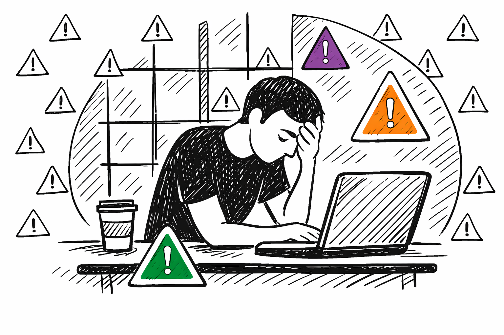

# El Problema del Volumen: Alertas y Fatiga del Analista

El mayor enemigo del SOC hoy en día no es la sofisticación de los atacantes: es el **volumen**. Miles de alertas diarias, la mayoría falsas, agotan a los equipos y hacen que los incidentes reales se pierdan en el ruido.

---

## 1. La explosión de alertas en el SOC

La superficie de ataque creció exponencialmente en los últimos años. Más endpoints, más usuarios remotos, más servicios cloud, más integraciones de terceros. Cada fuente genera logs. Cada log puede generar una alerta.

Un SOC mediano recibe entre **1.000 y 10.000 alertas por día**. Algunos reportes de organizaciones grandes hablan de hasta 100.000 alertas diarias. Con esas cifras, la revisión manual es imposible.

¿Por qué hay tantas alertas?

- **Reglas de detección demasiado amplias:** escritas para no perderse nada, pero que capturan demasiado ruido. por ejemplo, marcar cualquier uso de PowerShell como malicioso.
- **Falta de contextualización:** el SIEM no sabe si un comportamiento es normal para ese usuario o no.
- **Múltiples fuentes que repiten el mismo evento:** un mismo incidente puede generar alertas del firewall, el EDR, el proxy y el SIEM al mismo tiempo.
- **Reglas obsoletas:** escritas para entornos que ya cambiaron y que hoy generan falsos positivos masivos.

### Falsos positivos

Un **falso positivo** es una alerta que el sistema genera pensando que hay una amenaza, pero que en realidad corresponde a actividad legítima. Cada falso positivo consume tiempo de análisis. Si el 90% de las alertas son falsas (lo cual no es raro), el analista solo dedica el 10% de su tiempo a amenazas reales. Además, cuando todo parece una alerta, el analista pierde la capacidad de distinguir lo urgente.

---
## 3. Fatiga del analista y sus consecuencias

La **fatiga del analista** es el agotamiento cognitivo que resulta de revisar miles de alertas repetitivas con escaso impacto real. Es uno de los factores más subestimados en la seguridad operacional.

**Síntomas de la fatiga del analista:**

- Cierre de alertas sin revisar correctamente ("alert dismissal").
- Disminución de la atención en horas críticas (madrugada, fin de semana).
- Alta rotación del personal en el SOC (el burnout es una causa frecuente de renuncia).
- Desconfianza en las herramientas: si "todo es falso positivo", se ignoran alertas reales.

**Consecuencias operacionales directas:**

- Incidentes reales pasan desapercibidos durante horas o días.
- El dwell time (tiempo que el atacante permanece en la red sin ser detectado) se extiende significativamente.
- Se afecta la calidad de las investigaciones porque el analista está sobrecargado.

---
## 4. El costo de la inacción

No automatizar y no resolver el problema del volumen tiene un costo medible y alto.

**Costo humano:** Los analistas de SOC tienen una de las tasas de burnout más altas en IT. Reemplazar a un analista de T2 o T3 cuesta entre 6 y 12 meses de productividad perdida entre búsqueda, contratación y curva de aprendizaje.

**Costo de un incidente no detectado:** El costo promedio de una brecha de datos en 2023 fue de **USD 4,45 millones** según IBM. Gran parte de ese costo se explica por el tiempo que el atacante pasó sin ser detectado dentro de la red.

**Costo regulatorio:** En sectores como finanzas o salud, una brecha no detectada a tiempo puede derivar en multas millonarias bajo GDPR, HIPAA u otras normativas sectoriales.

**Costo reputacional:** Difícil de cuantificar pero real: la pérdida de confianza de clientes y socios tras un incidente mal gestionado puede tener efectos duraderos en el negocio.

---

> **Conclusión:** El modelo de SOC puramente manual está roto. El volumen superó la capacidad humana hace años. La automatización no es un lujo: es la única forma sostenible de operar un SOC efectivo.
