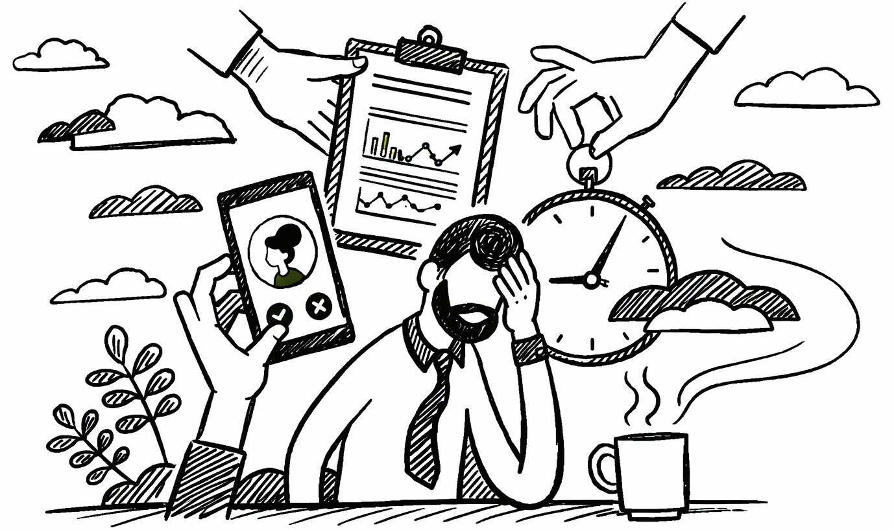
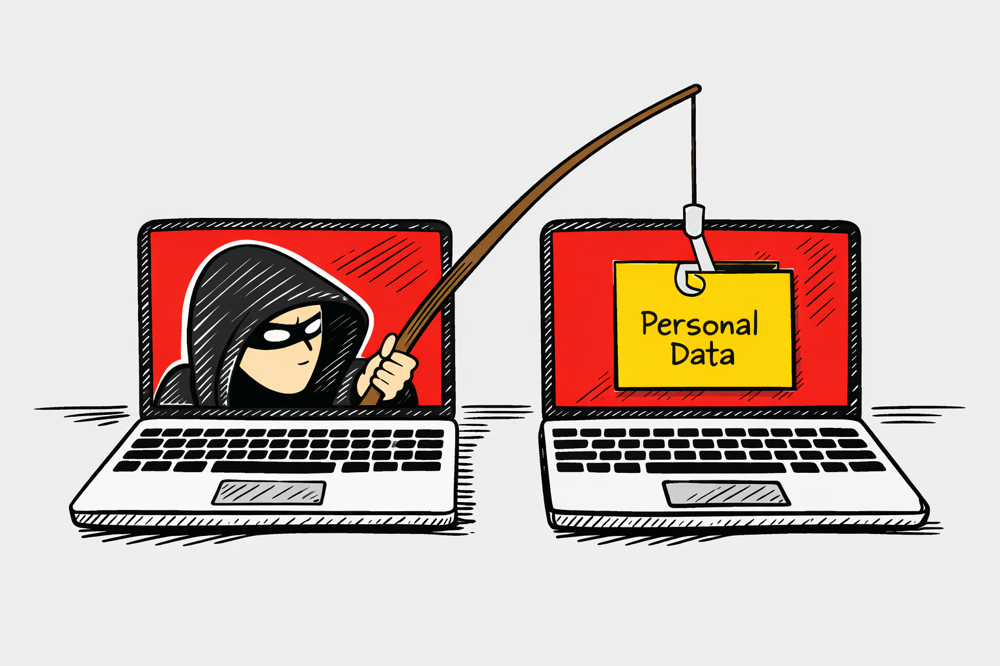
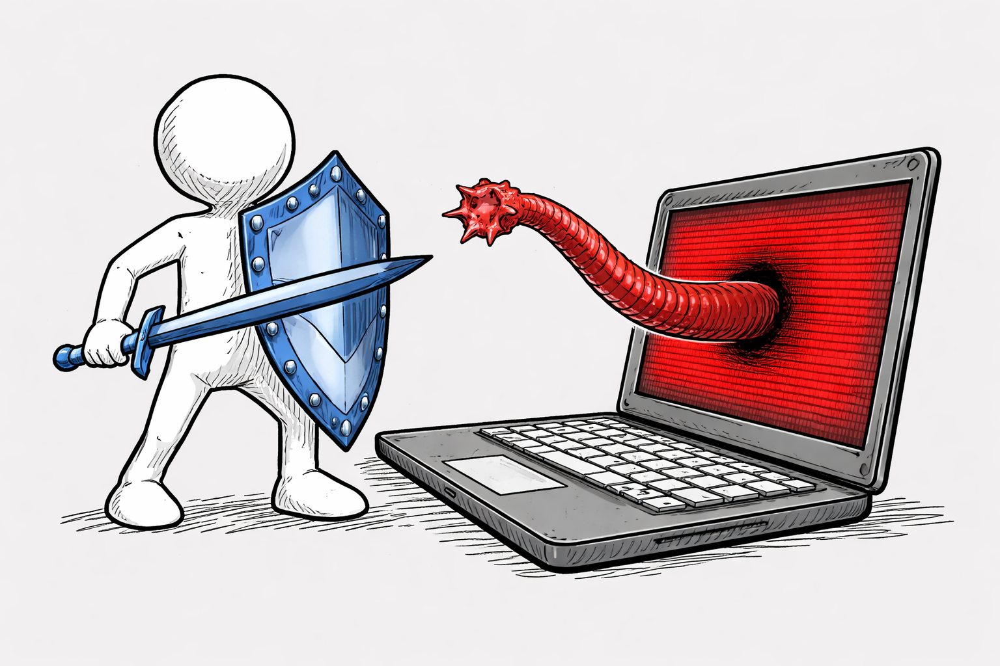
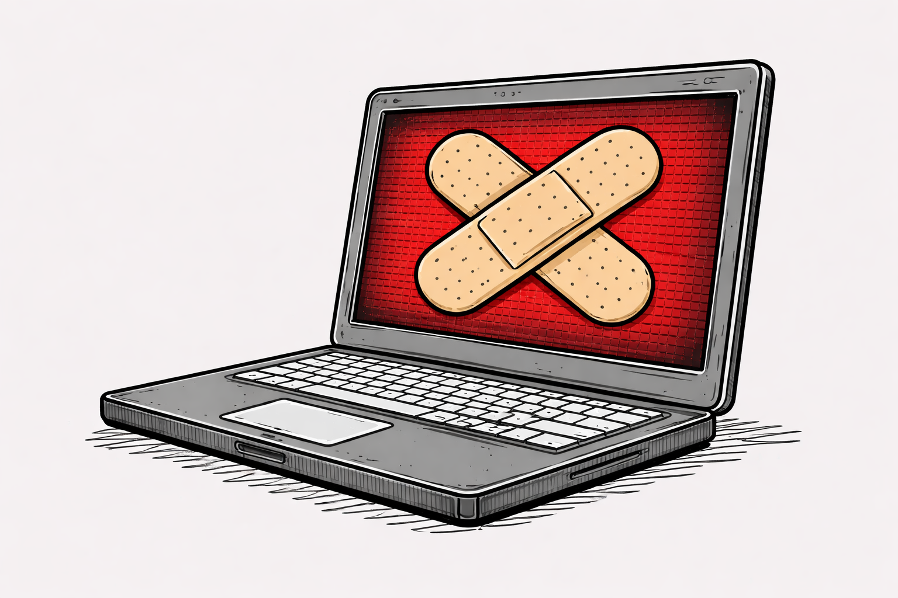
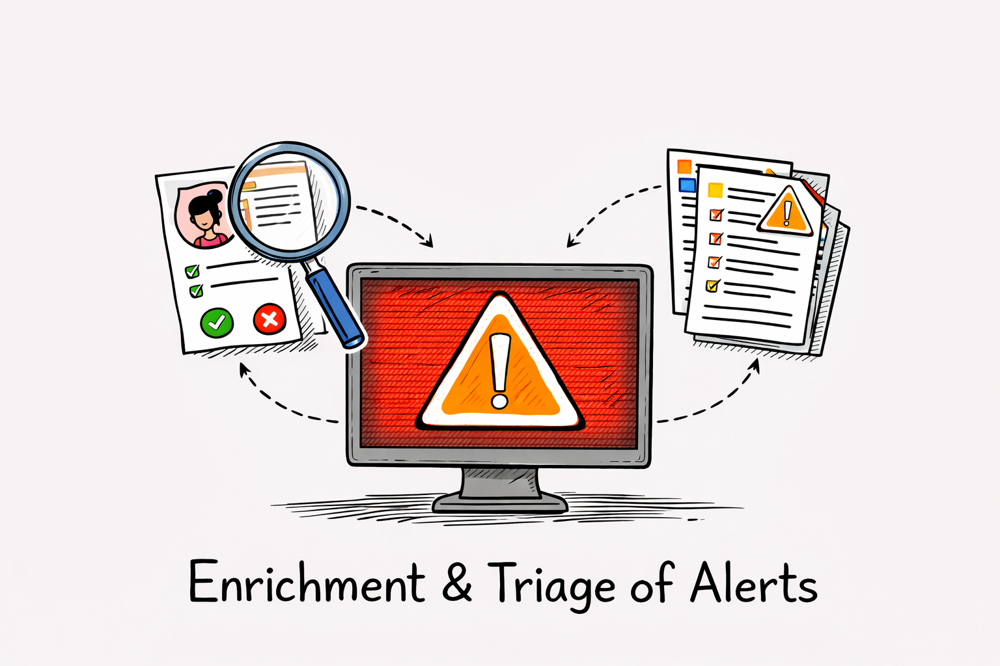

# Por Qué la Automatización es Obligatoria

La automatización no es una opción de lujo en los centros de operaciones de seguridad, sino una necesidad fundamental. Los equipos de ciberseguridad enfrentan un volumen sin precedentes de alertas, amenazas y eventos de seguridad. Sin automatización, las organizaciones se ven atrapadas en un ciclo de respuesta manual lento, ineficiente y propenso a errores humanos. 

## 1. Limitaciones del modelo manual

El enfoque completamente manual de la seguridad enfrenta desafíos que se multiplican cada año. Los analistas de seguridad deben analizar miles de alertas diarias, tomar decisiones rápidamente y ejecutar acciones dentro de ventanas de tiempo críticas. Sin embargo, el ser humano tiene limitaciones biológicas: fatiga, distracción, necesidad de descanso y una capacidad de procesamiento finita que no escala con el volumen de amenazas.

La **velocidad de respuesta manual** es incompatible con la velocidad de los ataques modernos. Un atacante puede comprometer múltiples sistemas en minutos, pero un analista manual tardará horas o días en detectar y responder al incidente. Mientras tanto, el adversario tiene libertad para moverse lateralmente, exfiltrar datos y establecer persistencia. Esta brecha temporal es una ventaja crítica que los atacantes explotan constantemente.

El **costo operacional** de la respuesta manual es insostenible. Para procesar el mismo volumen de alertas manualmente se requerirían equipos cada vez más grandes, lo que aumenta exponencialmente los costos de personal, capacitación y retención. Muchas organizaciones simplemente no tienen presupuesto para contratar suficientes analistas especializados, especialmente en regiones con escasez de talento en seguridad.

La **tasa de error humano** es otro factor crítico. Los analistas pueden cometer errores de juicio, olvidar pasos en procedimientos, o simplemente pasar por alto eventos en medio de la sobrecarga de información. Estos errores pueden resultar en incidentes no detectados, falsos negativos costosos, o acciones incorrectas que empeoran la situación. La fatiga mental acelera estos errores conforme avanza el turno.

## 2. Beneficios de la automatización en el SOC

La automatización aporta beneficios tangibles y medibles que transforman la operación de seguridad. El primero y más evidente es la **aceleración del tiempo de respuesta**. Tareas que antes tomaban minutos u horas ahora se ejecutan en segundos. Un playbook automatizado puede aislar un endpoint comprometido, recolectar evidencia forense, notificar a los stakeholders y crear un ticket en el sistema de gestión de incidentes, todo en menos de un minuto.

La **consistencia y fiabilidad** mejoran dramáticamente. Las máquinas ejecutan procedimientos exactamente como se les programa, sin variaciones ni omisiones. Si una tarea debe incluir cinco pasos, se ejecutarán siempre los cinco pasos en el mismo orden y con la misma precisión. Esto elimina las inconsistencias introducidas por diferentes analistas o por la fatiga humana. Los playbooks actúan como procedimientos codificados que nunca olvidan un paso.

La automatización permite **escalar la capacidad de respuesta sin escalar proporcionalmente los costos**. Un playbook puede ejecutarse para decenas de miles de eventos con un costo marginal muy bajo. La inversión inicial en diseñar, implementar y probar un playbook se amortiza rápidamente a través de miles de ejecuciones. Esto libera a los analistas humanos para tareas de mayor valor, como la investigación de incidentes complejos, la caza de amenazas (threat hunting) y la mejora continua.

La **reducción de la sobrecarga cognitiva** es beneficiosa para la retención de personal. Cuando los analistas ya no deben manejar manualmente tareas repetitivas y mecánicas, pueden enfocarse en problemas interesantes y complejos que mantienen su motivación. Esto mejora significativamente la satisfacción laboral y reduce la rotación, que es un problema crítico en la industria de ciberseguridad.

## 3. Casos de uso de alto impacto

Algunos escenarios de automatización generan impacto inmediato y medible. 

### Phishing
La **respuesta a phishing** es un candidato ideal. Cuando un email de phishing ingresa al sistema, un playbook automatizado puede: extraer automáticamente las direcciones de email del remitente, dominios y URLs incluidas en el mensaje; verificarlas contra bases de datos de amenazas; bloquear el email si es malicioso; aislarlo en cuarentena; notificar al usuario que fue víctima de un intento de phishing; y generar una entrada en el caso de seguridad. Todo esto ocurre en segundos, evitando que otros usuarios hagan clic en el enlace malicioso.

### Malware
La **detección y contención de malware** se beneficia enormemente de la automatización. Cuando un endpoint reporta actividad sospechosa (como la ejecución de un archivo de una carpeta temporal con un nombre aleatorio), un playbook puede: verificar el hash del archivo contra VirusTotal y bases de datos de amenazas internas; si es malicioso, aislar inmediatamente el endpoint de la red; recolectar logs y evidencia forense; ejecutar un escaneo profundo; y notificar al equipo de seguridad. Sin automatización, el malware se propaga mientras se espera la acción del analista.

### Remediación de vulnerabilidades
La **remediación de vulnerabilidades conocidas** puede automatizarse parcialmente. Cuando se anuncia una vulnerabilidad crítica, un playbook puede: identificar automáticamente todos los activos afectados en la red; generar órdenes de remediación; notificar a los propietarios de sistemas; rastrear el progreso de los parches; y escalar si no se aplican dentro de un plazo. Esto comprime semanas de trabajo manual en horas.

### Enriquecimiento y triage de alertas
El **enriquecimiento y triaje de alertas** es quizás el caso de uso más generalizado. Cada alerta debe ser evaluada para determinar si es real (verdadero positivo) o falsa (falso positivo). Automatizar este triaje mediante reglas y consultas a fuentes externas reduce significativamente el ruido que llega a los analistas, permitiéndoles enfocarse en amenazas reales.

