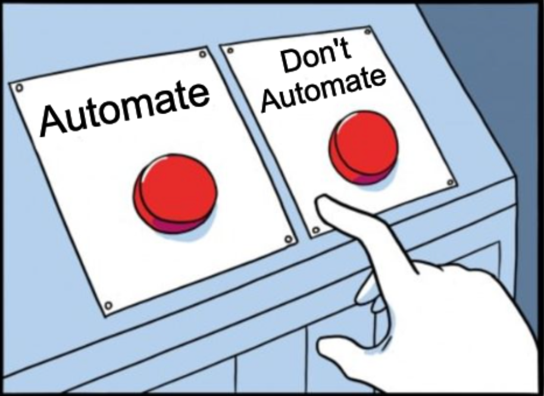
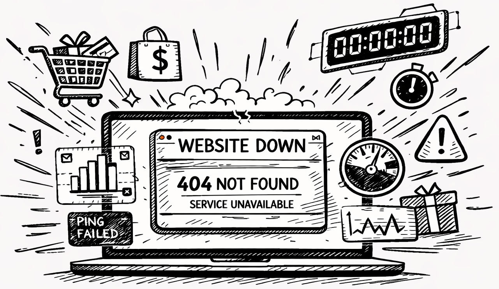
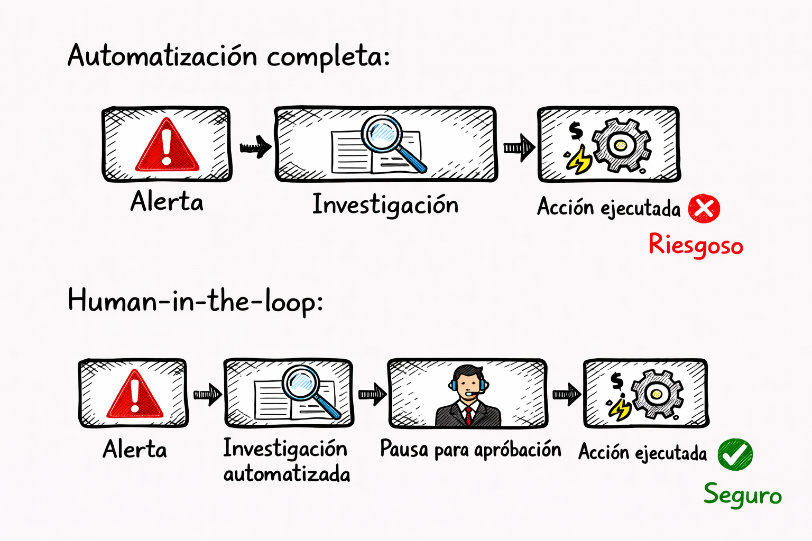
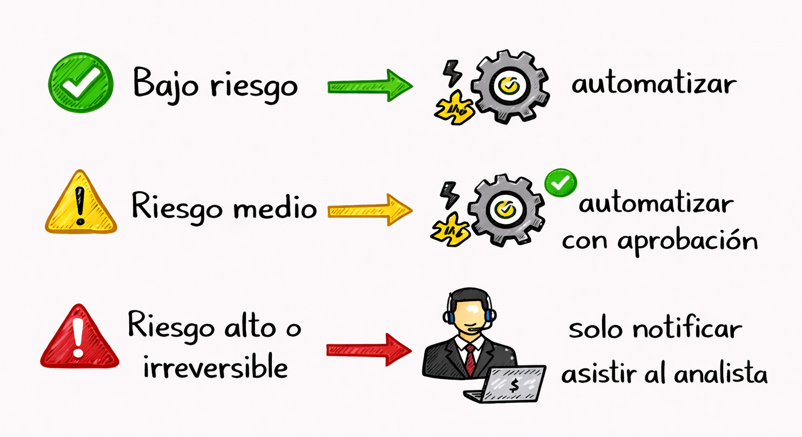

# Cuándo NO Automatizar



La automatización no es siempre la respuesta. En algunos casos, automatizar es peligroso. Un playbook que aisla incorrectamente un servidor de producción puede costar miles de dólares en downtime. Un playbook que bloquea automáticamente el acceso de un ejecutivo puede afectar el negocio. Tengamos discernimiento sobre cuándo la automatización es contraproducente y dónde el "human in the loop" es necesario.

## 1. Decisiones que requieren juicio humano


Algunas decisiones son demasiado complejas o ambiguas para automatización:

- **Decisiones con múltiples variables subjetivas**: "¿Es este comportamiento sospechoso o normal?" depende del contexto, rol, departamento, hora del año. Automatización falla en contexto matizado.

- **Decisiones que afectan empleados**: Acciones como "deshabilitar cuenta de usuario" afectan el trabajo de una persona real. Requiere verificación humana.

- **Frecuencia**: ¿Sucede frecuentemente? Si ocurre una vez por año, no vale la pena automatizar. Si ocurre 100 veces por día, automatizar puede ser transformador. 

- **Incidentes sin precedentes**: Si nunca viste este patrón antes, ¿cómo escribes un playbook? La máquina no puede manejar lo completamente nuevo.

## 2. Riesgos de falsos positivos en acciones bloqueantes

Hay que tener precaución cuando queremos automatizar acciones bloqueantes... Porque siempre podemos tener falsos positivos. Pero analicemos qué implica eso:
* Un falso positivo en "notificación" (enviar email diciendo "alerta sospechosa") es bajo riesgo. 
* Un falso positivo en "bloqueo" (aislar servidor, deshabilitar cuenta, borrar archivo) es alto riesgo.

Podríamos generar un impacto en la disponibilidad (denegación de servicio autoinfligida)... Por ejemplo, supongamos que tenemos un pico de trafico y lo confundimos con un DDoS y bajamos el servidor de nuestro sitio web de ventas... pero es "Black Friday".



## 3. Escenarios de alto impacto y baja tolerancia al error

Algunos sistemas tienen cero tolerancia al error:

- **Servidores de producción críticos**: El downtime cuesta dinero directamente. Aislar sin aprobación es prohibido.
- **Sistemas de backup**: Modificar/eliminar backups incorrectamente = pérdida de datos permanente. Requiere cuidado extremo.
- **Infraestructura de red central**: Bloquear router central = toda la red cae.
- **Sistemas de seguridad física**: Bloquear acceso a oficina = empleados quedan afuera.

Para estos: **automatizar investigación y recomendación, pero requerir aprobación humana antes de acción.**

## 4. El principio de "human in the loop"

Para situaciones riesgosas, siempre tenemos la opción de automatizar con “human in the loop”; que significa que el sistema automatiza investigación pero requiere decisión humana antes de acción irreversible:



Ejemplo en playbook:
```python
def playbook_con_human_in_loop():
    # Investigación automática
    evid = investigar_automaticamente()

    if evid['confianza'] > 0.95:
        # Confianza muy alta: ejecutar
        ejecutar_accion()
    elif evid['confianza'] > 0.7:
        # Confianza media: pausar para aprobación
        pausar_y_notificar_analista(evid)
        # Analista decide si proceder
    else:
        # Confianza baja: solo crear caso
        crear_caso_para_revision(evid)
```

## 5. Marco de decisión: automatizar vs. asistir vs. notificar

Pero no siempre es necesario automatizar o asistir... a veces, solo necesitamos notificar y que un analista haga la investigación correspondiente


Matriz de decisión:



| Tipo de Acción   | Frecuencia | Riesgo  | Decisión                             |
| :--------------- | :--------: | :-----: | :----------------------------------- |
| Notificación     |  Muy alta  |  Bajo   | AUTOMATIZAR completamente            |
| Investigación    |    Alta    |  Bajo   | AUTOMATIZAR completamente            |
| Bloqueo temporal |    Alta    |  Medio  | AUTOMATIZAR con aprobación           |
| Aislamiento      |   Media    |  Alto   | ASISTIR (recomendación + aprobación) |
| Eliminación      |    Baja    | Crítico | NOTIFICAR SOLO (nunca automatizar)   |

Ejemplos:

```
✓ AUTOMATIZAR:
- Crear caso en SOAR
- Enviar notificación email a usuario
- Enriquecer alerta con TI
- Bloquear URL en proxy web

~ ASISTIR (automatizar + aprobación):
- Bloquear IP en firewall (temporal, puede permitirse después)
- Resetear password de usuario
- Aislamiento de endpoint (pero no limpiar)

✗ NUNCA AUTOMATIZAR:
- Eliminar archivos
- Deshabilitar cuenta sin notificar
- Modificar configuración de backup
- Ejecutar comandos remotos peligrosos
```

La regla: Si es destructivo e irreversible, NO automatizar completamente. Si es reversible o exploratorio, automatizar liberalmente.