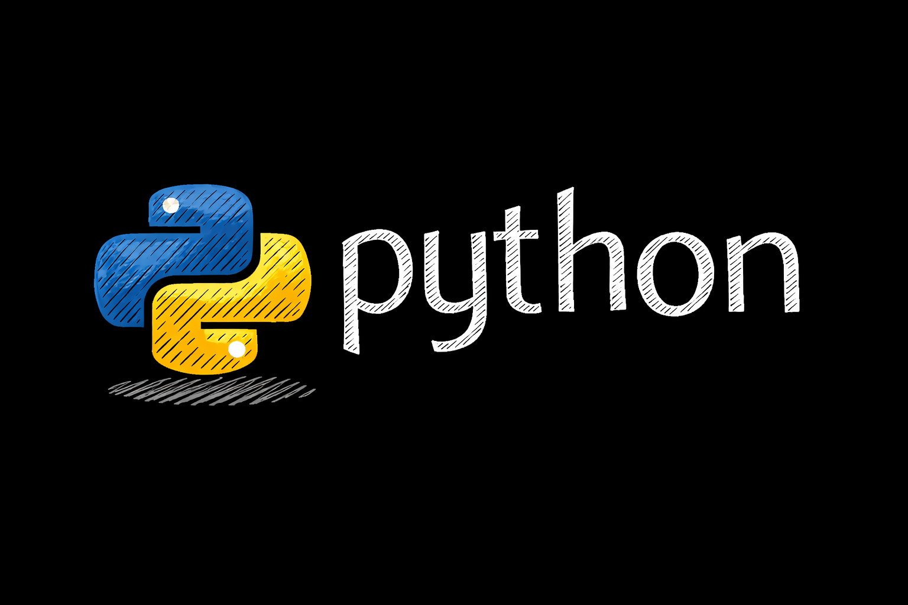
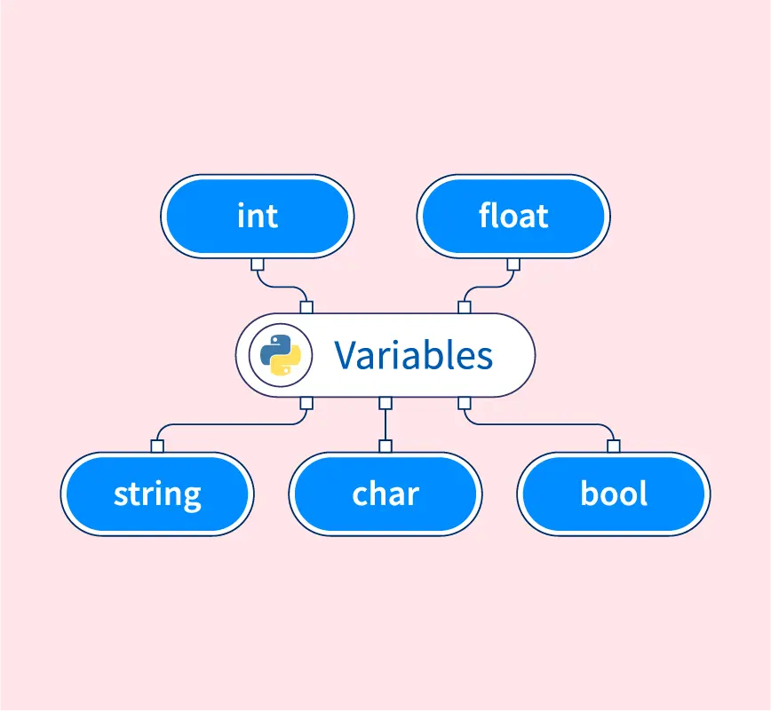
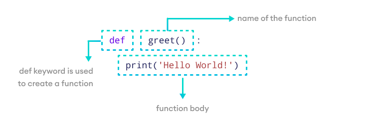
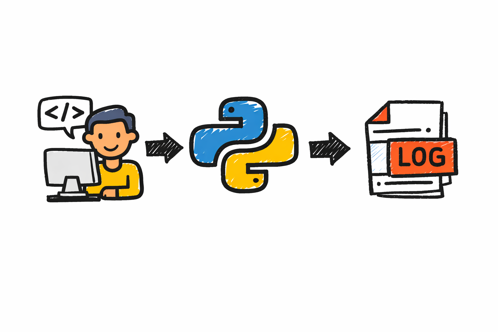

# Python para Analistas de Seguridad



Python se ha convertido en el lenguaje de programación de facto para la automatización de seguridad. A diferencia de lenguajes compilados como C++ que requieren habilidades de programación profundas, Python es accesible para analistas de seguridad sin formación formal en ingeniería de software. Su sintaxis clara y legible permite que incluso principiantes escriban scripts útiles rápidamente. Además, el ecosistema de librerías Python para seguridad es incomparablemente rico: herramientas para análisis de malware, procesamiento de logs, consumo de APIs, criptografía, y prácticamente cualquier tarea de seguridad que imagines ya tiene librerías maduras disponibles.

## 1. Por qué Python en el SOC

**Simplicidad y legibilidad** son las razones primarias por las que Python es preferido en seguridad. Comparado con Java o C++, Python tiene mucho menos boilerplate (código repetitivo requerido). Un script Python que toma 20 líneas puede requerir 100+ líneas en Java. Los analistas de seguridad, que no son programadores profesionales, necesitan lenguajes donde el código sea legible sin masticarlo durante horas.

**Velocidad de desarrollo** es crítica en operaciones de seguridad donde la urgencia es constante. Un analista debe poder escribir un script útil en 30 minutos, no pasar dos días compilando y debugueando en C++. Python permite iterar rápidamente, probar ideas, y refinar soluciones sin fricción. Esta agilidad es perfecta para la naturaleza experimental y adaptativa de la respuesta a incidentes.

El **ecosistema de librerías** para seguridad es excepcional. Librerías como `requests` (para HTTP), `paramiko` (para SSH), `cryptography` (para criptografía), `yara` (para detección de malware), y cientos más están maduras, bien mantenidas, y documentadas. No necesitas escribir código para hablar HTTP o conectarte a un servidor: simplemente importas una librería y la usas en tres líneas.

**Integración con herramientas existentes** es seamless. Prácticamente todas las plataformas de seguridad moderna (Splunk, Elasticsearch, AWS, Google Cloud, Azure, Fortinet, CrowdStrike, etc.) tienen librerías Python o APIs REST que Python puede consumir fácilmente. Esto hace que Python sea el pegamento perfecto para conectar herramientas dispares.

**Disponibilidad de talentos** también juega un rol. Python es el lenguaje más enseñado en universidades y bootcamps de seguridad. Muchos analistas de seguridad tienen experiencia con Python. Esto significa que los scripts que escribes hoy serán mantenibles por otros analistas en el futuro, reduciendo el riesgo de que un script crítico se vuelva "código spaghetti" que nadie entiende.

## 2. Conceptos básicos: variables, funciones y estructuras de datos

### Variables



Todo script Python comienza con **variables** que almacenan datos. Una variable es simplemente un nombre que se refiere a un valor. Este valor puede ser texto (String), un número entero (Integer), un número decimal (Float) o un valor verdadero/falso (Bool)

```python
nombre_usuario = "admin"       # String
ip_address = "192.168.1.100"   # String
puerto = 443                   # Integer
confianza_alerta = 0.95        # Float
es_malicioso = True            # Bool
```

Las **estructuras de datos** agrupan múltiples valores. Las más comunes son:

```python
# Lista (ordenada, mutable)
dominios_sospechosos = ["malware.com", "phishing.net", "badsite.org"]

# Diccionario (pares clave-valor)
evento = {
    "usuario": "jperez",
    "accion": "login_fallido",
    "timestamp": "2024-03-18T14:32:00Z",
    "ip_origen": "203.0.113.45",
    "intentos": 5
}

# Conjunto (sin orden, valores únicos)
ips_bloqueadas = {"192.168.1.1", "203.0.113.5", "198.51.100.10"}

# Tupla (ordenada, inmutable)
coordenadas = (40.7128, -74.0060)
```

### Funciones y control de flujo

```python
# definimos la funcion
def procesar_log(archivo):
	for linea in archivo: # bucle
		if "Error" in linea: # condicion
			print(linea)
```

#### Funciones



Las **funciones** empaquetan lógica reutilizable. Cuando escribís scripts, constantemente necesitás hacer las mismas verificaciones: ¿esta IP está en mi lista de bloqueadas? ¿Cuál es el riesgo de este evento? En lugar de copiar y pegar el mismo código diez veces, escribís una función una sola vez y la llamás para ejecutarla desde donde la necesites. Las funciones también hacen tu código más legible y más fácil de probar/testear.

```python
def verificar_ip_conocida(ip, lista_ips_conocidas):
    """Verifica si una IP está en nuestra lista de conocidas"""
    return ip in lista_ips_conocidas

def calcular_riesgo(falsos_positivos, verdaderos_positivos):
    """Calcula la ratio de confianza"""
    if verdaderos_positivos == 0:
        return 0
    return verdaderos_positivos / (falsos_positivos + verdaderos_positivos)

# Uso
resultado = verificar_ip_conocida("192.168.1.1", lista_ips)
riesgo = calcular_riesgo(2, 8)
```

#### Condicionales

Los condicionales (`if`, `elif`, `else`) son el mecanismo que te permite automatizar decisiones y definir las reglas.

```python
if evento["intentos"] > 3:
    accion = "bloquear_usuario"
elif evento["intentos"] == 3:
    accion = "alertar_analista"
else:
    accion = "registrar_y_continuar"
```

#### Bucles

Los **bucles** repiten operaciones sobre colecciones. Cuando procesás logs en el SOC, raramente mirás un único evento — mirás miles. Un bucle te permite iterar sobre cada evento (cada línea, cada diccionario en una lista) y aplicar la misma lógica a todos. 

```python
# Iterar sobre lista
dominios = ["google.com", "microsoft.com", "malware.com"]
for dominio in dominios:
    print(f"Verificando {dominio}")

# Iterar sobre diccionario
evento = {"usuario": "admin", "accion": "login", "timestamp": "2024-03-18"}
for clave, valor in evento.items():
    print(f"{clave}: {valor}")
```

## 3. Manipulación de archivos y logs

La mayoría de tareas de automatización en el SOC implican **leer y procesar logs**. Python hace esto trivial:

```python
# Leer un archivo de log línea por línea
with open("/var/log/auth.log", "r") as archivo:
    for linea in archivo:
        if "Failed password" in linea:
            print(f"Login fallido detectado: {linea}")

# Procesar un archivo grande eficientemente
intentos_fallidos = {}
with open("/var/log/apache.log", "r") as f:
    for linea in f:
        # Extraer IP de la línea
        ip = linea.split(" ")[0]
        intentos_fallidos[ip] = intentos_fallidos.get(ip, 0) + 1

# Mostrar IPs con más de 5 intentos
for ip, count in intentos_fallidos.items():
    if count > 5:
        print(f"IP sospechosa: {ip} con {count} intentos")
```

El **procesamiento de logs estructurados** es común con JSON:

```python
import json

# Leer logs en formato JSON (common en Splunk, Elasticsearch)
with open("security_events.json", "r") as f:
    eventos = [json.loads(linea) for linea in f]

# Filtrar eventos específicos
alertas_criticas = [e for e in eventos if e.get("severity") == "CRITICAL"]

# Escribir resultados en un nuevo archivo
with open("criticas.json", "w") as f:
    json.dump(alertas_criticas, f, indent=2)
```

### Expresiones regulares

Las **expresiones regulares** sirven para buscar y extraer patrones dentro de un texto. Esto es muy útil en seguridad porque muchos logs no vienen perfectamente ordenados, sino como grandes bloques de texto donde la información importante está mezclada.

Con regex, en vez de buscar una palabra exacta, podés buscar un **patrón**. Por ejemplo, una dirección IP, un hash, un email o un comando, aunque aparezcan con pequeñas variaciones.

Son especialmente útiles para sacar datos concretos de logs que no están bien estructurados.



```python
import re

log_line = "2024-03-18 14:32:15 User admin logged in from 192.168.1.50"

# Extraer IP
match = re.search(r'\d+\.\d+\.\d+\.\d+', log_line)
if match:
    ip = match.group()
    print(f"IP encontrada: {ip}")

# Buscar patrones de comando sospechoso
patrones_maliciosos = [
    r".*cmd\.exe.*",
    r".*powershell.*-nop.*",
    r".*base64.*-d.*"
]

linea = "proceso iniciado: cmd.exe /c whoami"
if any(re.match(p, linea) for p in patrones_maliciosos):
    print("Comando sospechoso detectado!")
```

## 4. Librerías esenciales para seguridad

Una de las razones por las que Python es tan poderoso para seguridad es que el ecosistema tiene librerías maduras para prácticamente cualquier tarea. Por ejemplo:

**requests** es la librería para consumir APIs HTTP. Prácticamente toda herramienta de seguridad hoy en día expone una API: VirusTotal, CrowdStrike, Splunk, Jira, tu cloud provider. 

`requests` hace que hablar con esas APIs sea tan simple como escribir dos líneas de Python.

```python
import requests

# GET - obtener información
response = requests.get("https://api.virustotal.com/api/v3/files/hash",
                        headers={"x-apikey": "tu_api_key"})
if response.status_code == 200:
    resultado = response.json()
    print(f"Detecciones: {resultado['data']['attributes']['last_analysis_stats']}")

# POST - enviar datos (ej: reportar IP)
datos = {"ip": "203.0.113.45", "razon": "malware_c2"}
response = requests.post("https://api.company.com/report", json=datos)
```

**hashlib** para trabajar con hashes. Los hashes son las huellas dactilares de los archivos. Podemos calcular el SHA256 de un archivo y buscarlo en bases de datos de inteligencia de amenazas. Python te permite calcular hashes criptográficos sin instalar herramientas externas.

```python
import hashlib

archivo_bytes = b"contenido sospechoso"
hash_md5 = hashlib.md5(archivo_bytes).hexdigest()
hash_sha256 = hashlib.sha256(archivo_bytes).hexdigest()

print(f"MD5: {hash_md5}")
print(f"SHA256: {hash_sha256}")
```

**paramiko** para automatización de sistemas remotos. Cuando necesitás responder rápidamente a un incidente, muchas veces tenés que ejecutar comandos en máquinas Linux remotas: aislar el servidor, revisar los procesos activos, extraer logs. 

Paramiko te permite conectarte a través de SSH programáticamente y ejecutar comandos como si estuvieras en una terminal pero desde tu script Python, sin intervención manual.

```python
import paramiko

ssh = paramiko.SSHClient()
ssh.set_missing_host_key_policy(paramiko.AutoAddPolicy())
ssh.connect("192.168.1.100", username="admin", password="pass123")

# Ejecutar comando remoto
stdin, stdout, stderr = ssh.exec_command("ps aux | grep malware")
print(stdout.read().decode())

ssh.close()
```

**datetime** para manipulación de timestamps. Los logs están llenos de timestamps: cuándo pasó cada evento. Necesitás comparar tiempos, calcular duraciones, parsear formatos de fecha extraños que cada herramienta usa diferente. `datetime` abstrae toda esa complejidad y te permite trabajar con fechas como objetos Python simples.

```python
from datetime import datetime, timedelta

ahora = datetime.now()
hace_24h = ahora - timedelta(days=1)

# Parsear timestamp de log
timestamp_log = "2024-03-18T14:32:15Z"
fecha = datetime.fromisoformat(timestamp_log.replace("Z", "+00:00"))

print(f"Alerta antigua: {fecha < hace_24h}")
```

## 5. Consumir APIs 

En el SOC, prácticamente toda integración con herramientas externas se hace a través de **APIs REST**. Una API es la interfaz que expone una herramienta (VirusTotal, CrowdStrike, Splunk) para que otros sistemas la controlen programáticamente. El patrón es siempre el mismo: enviás una solicitud HTTP a una URL, con un header de autenticación, y recibís una respuesta JSON.

**Métodos HTTP** — indican qué querés hacer:

| Método | Uso típico en el SOC                              |
| ------ | ------------------------------------------------- |
| `GET`  | Consultar datos (leer alertas, verificar un hash) |
| `POST` | Crear o ejecutar (aislar endpoint, abrir ticket)  |
| `PUT`  | Actualizar (cambiar estado de una alerta)         |

**Autenticación** — toda API de seguridad requiere credenciales:
- **API Key**: `headers={"x-apikey": "tu-clave"}` — simple, sin expiración
- **Bearer Token**: `headers={"Authorization": "Bearer eyJ..."}` — con expiración, más seguro. OAuth 2.0 (CrowdStrike, Microsoft) genera estos tokens automáticamente antes de cada llamada.

**Algunos códigos de respuesta**: 
* `200` OK
* `201` Creado 
* `401` Sin autorización 
* `404` No encontrado 
* `429` Rate limit (esperá antes de reintentar) 
* `500` Error del servidor

El patrón completo:

```python
import requests

response = requests.get(
    "https://api.virustotal.com/api/v3/files/abc123",
    headers={"x-apikey": VT_API_KEY},
    timeout=10
)

if response.status_code == 200:
    data = response.json()          # respuesta como diccionario Python
elif response.status_code == 429:
    print("Rate limit — esperá antes de reintentar")
```

---

Con estas herramientas (estructuras de datos, funciones, manejo de archivos, y consumo de APIs) tenés lo necesario para escribir scripts de automatización. Las siguientes clases del módulo construyen directamente sobre esto: autenticación segura de credenciales, formatos de log, buenas prácticas de código, y eventualmente pipelines ETL y conectores de producción. Python es el hilo conductor de todo el módulo.
