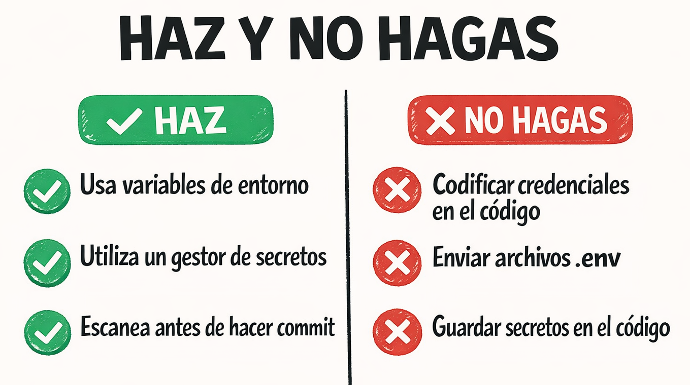
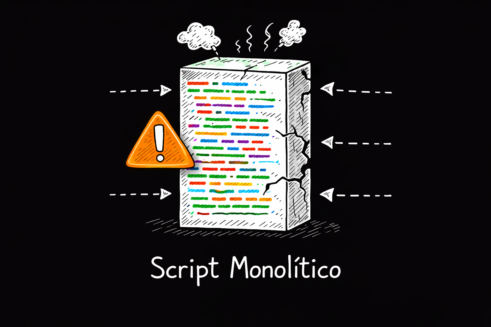
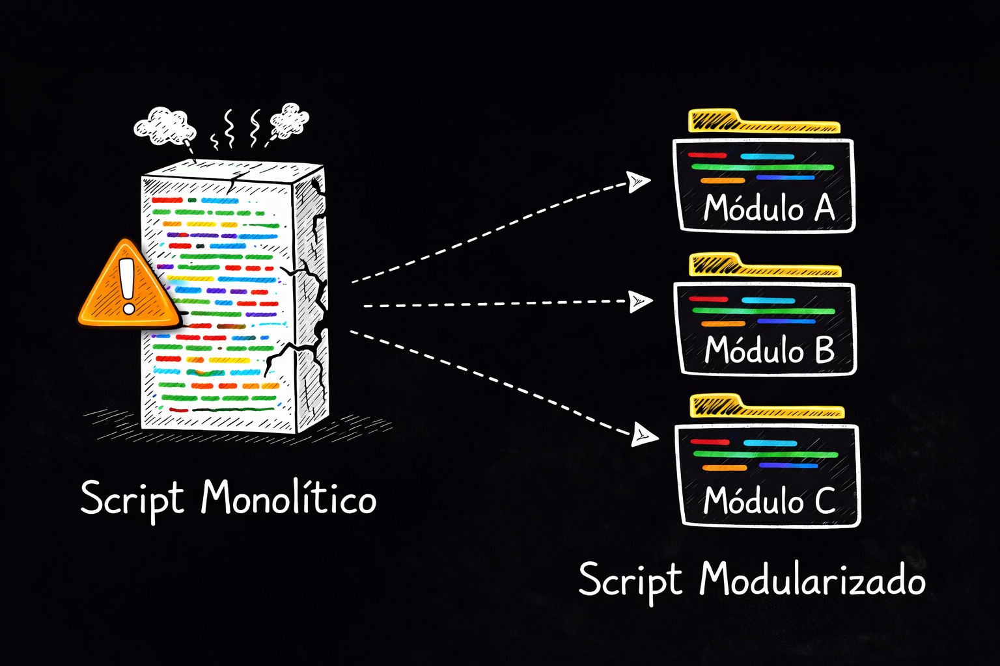
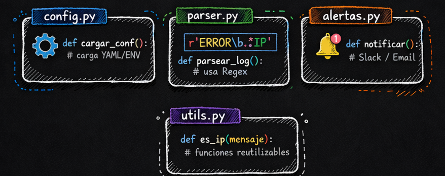
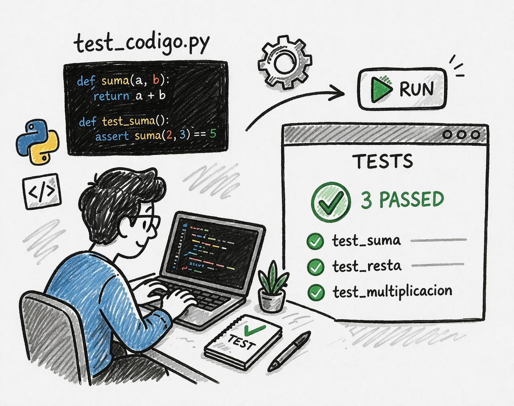
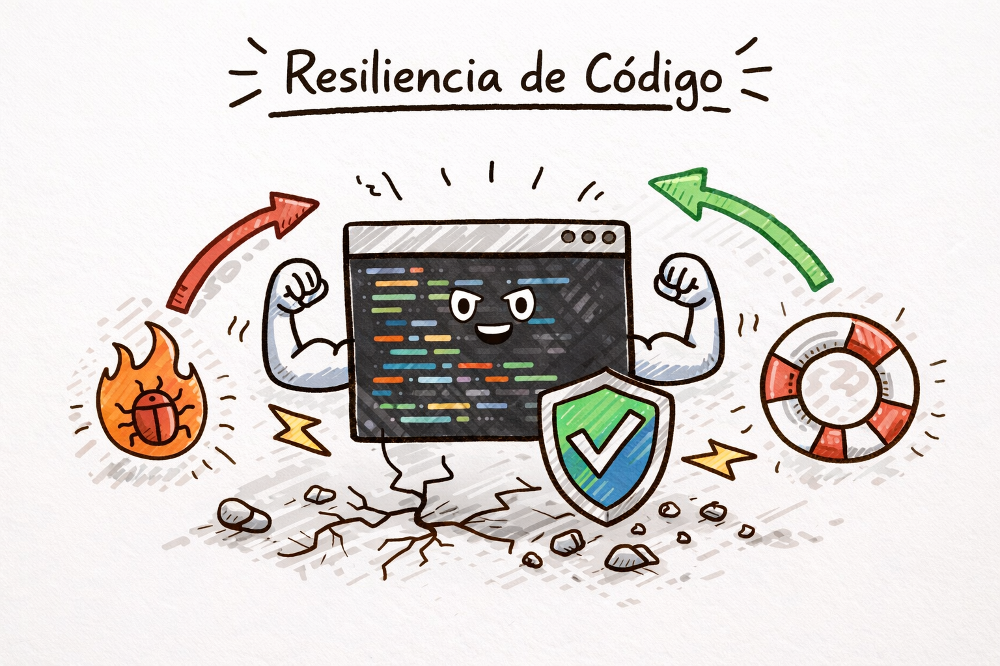

# Buenas Prácticas para Scripts de Automatización en el SOC

Un script que funciona una vez no es suficiente. Lo importante es que funcione de manera confiable, que no filtra credenciales, que avisa cuando falla, que puede ser mantenido por otro analista y testeado antes de ir a producción. Este archivo cubre las prácticas que separan el scripting improvisado de una solución profesional.

---

## 1. Gestión segura de credenciales



Los scripts de automatización del SOC pueden aislar endpoints, bloquear usuarios, acceder a datos sensibles. El error más grave que podés cometer es **hardcodear credenciales en el código**. Sucede todo el tiempo, y las consecuencias son serias:

```python
# NUNCA HAGAS ESTO
import requests

api_key = "sk_live_1234567890abcdefghijk"
password = "SuperSecure123!@#"

response = requests.get("https://api.virustotal.com/files/hash",
                        headers={"x-apikey": api_key})
```

Si alguien accede al repositorio git, ve las credenciales. Si hacés un commit accidental a GitHub público, las credenciales quedan en la historia de git, incluso si borrás el archivo después. Si alguien compromete el servidor donde corre el script, encuentra las credenciales en el archivo de código.

Las credenciales **nunca** deben estar en código fuente, archivos de configuración versionados, logs, URLs de conexión ni comentarios.


### Variables de entorno

El método más simple: la credencial vive en el entorno del sistema operativo, no en el código.

```python
import os
import requests

api_key = os.getenv("VIRUSTOTAL_API_KEY")

if not api_key:
    raise ValueError("Variable VIRUSTOTAL_API_KEY no configurada")

response = requests.get("https://api.virustotal.com/files/hash",
                        headers={"x-apikey": api_key})
```

Para configurar la variable antes de ejecutar el script:

```bash
export VIRUSTOTAL_API_KEY="sk_live_1234567890abcdefghijk"
python mi_script.py
```

### Archivos .env

Cuando tenés muchas credenciales, exportar variables a mano se vuelve impráctico. La solución es un archivo **.env** que vive en la máquina donde corre el script, nunca en git. Python lo carga automáticamente al inicio con la librería `python-dotenv`:

```ini
# .env — este archivo NUNCA se versionea en git
VIRUSTOTAL_API_KEY=sk_live_1234567890abcdefghijk
SPLUNK_HOST=splunk.company.com
SPLUNK_USERNAME=admin
SPLUNK_PASSWORD=VerySecurePassword123
CROWDSTRIKE_CLIENT_ID=abc123def456
CROWDSTRIKE_CLIENT_SECRET=xyz789uvw
```

```python
from dotenv import load_dotenv
import os

load_dotenv()  # Carga el .env al iniciar

virustotal_key = os.getenv("VIRUSTOTAL_API_KEY")
splunk_host    = os.getenv("SPLUNK_HOST")

# Validar que todo lo necesario está presente
required_vars = ["VIRUSTOTAL_API_KEY", "SPLUNK_HOST", "SPLUNK_USERNAME"]
for var in required_vars:
    if not os.getenv(var):
        raise EnvironmentError(f"Variable requerida {var} no está configurada")
```

Dos cosas críticas: el `.env` va en `.gitignore`, y en el repositorio subís solo un `.env.example` con la estructura pero sin valores reales, para que otro analista sepa qué variables necesita configurar.

```bash
# .gitignore
.env
.env.local
*.pyc
__pycache__/
```

### Vaults (entornos empresariales)

Para producción real en empresas, los archivos `.env` son insuficientes. La solución son los **secret vaults**: sistemas centralizados donde las credenciales se almacenan cifradas y los scripts las consultan en tiempo de ejecución. El servidor donde corre el script nunca tiene las credenciales en disco, solo sabe cómo pedirlas. Cuando rotás una credencial, la actualizás en un solo lugar y todos los scripts la obtienen automáticamente.

Las opciones más comunes son **HashiCorp Vault** (open source, muy usado en entornos on-premise), **AWS Secrets Manager** (si el SOC corre en AWS) y **Azure Key Vault** (entornos Microsoft). No vamos a entrar en el código de cada uno, es configuración de infraestructura que varía mucho por organización. 

Lo importante es saber que existen, que las empresas maduras los usan, y que cuando llegués a un SOC enterprise probablemente ya tengan uno configurado.

---

## 2. Modularidad: código que escala

### El problema del script monolítico



El punto de partida de la mayoría es escribir todo en un solo archivo, de arriba hacia abajo. Funciona al principio. Después de 200 líneas, se convierte en un caos para debuggear, imposible de testear, difícil de reutilizar, una sola falla rompe todo.

```python
# script_todo_junto.py - el antipatrón clásico
import requests, json, smtplib

api_key = "abc123"  # hardcodeada
data = requests.get("https://api.test.com/api/v3", headers={"x-apikey": api_key}).json()
if data["data"]["attributes"]["last_analysis_stats"]["malicious"] > 0:
    print("malicioso!")
    # ... 50 líneas más de parseo ...
    # ... luego lógica de email ...
    # ... luego lógica de ticketing ...
    # ... nadie entiende qué hace este archivo
```

### Separar responsabilidades con funciones

La primera mejora es separar responsabilidades en funciones con nombres descriptivos. Cada función hace una única cosa: consulta a VT, parsea la respuesta, decide la acción. Esto tiene múltiples beneficios: podés testear cada función independientemente, reutilizarlas en otros contextos, y cuando algo falla, sabés exactamente cuál función es el culpable.

```python
def consultar_virustotal(hash_valor, api_key):
    """Consulta VirusTotal y retorna el resultado crudo"""
    url = f"https://www.virustotal.com/api/v3/files/{hash_valor}"
    response = requests.get(url, headers={"x-apikey": api_key})
    response.raise_for_status()
    return response.json()

def parsear_resultado_vt(respuesta_vt):
    """Extrae solo los campos relevantes del JSON de VT"""
    attrs = respuesta_vt["data"]["attributes"]
    stats = attrs["last_analysis_stats"]
    return {
        "malicious": stats["malicious"],
        "suspicious": stats["suspicious"],
        "nombre": attrs.get("meaningful_name", "desconocido"),
        "tipo": attrs.get("type_description", "desconocido"),
        "es_malicioso": stats["malicious"] > 0
    }

def decidir_accion(resultado_parseado, umbral=3):
    """Determina qué acción tomar basándose en el resultado"""
    if resultado_parseado["malicious"] >= umbral:
        return "AISLAR_INMEDIATAMENTE"
    elif resultado_parseado["malicious"] > 0:
        return "INVESTIGAR"
    return "MONITOREAR"

# El flujo principal es legible
def analizar_hash(hash_valor, api_key):
    raw = consultar_virustotal(hash_valor, api_key)
    resultado = parsear_resultado_vt(raw)
    accion = decidir_accion(resultado)
    return resultado, accion
```

### Estructura de proyecto modular



Para proyectos más grandes (un conjunto de playbooks, un pipeline de enriquecimiento), la modularidad implica separar en archivos. Cada concepto vive en su propio módulo: todas las integraciones con VirusTotal en un archivo, todos los parsers de logs en otro, todas las acciones de respuesta en otro.

```
soc_automation/
├── config.py              # configuración y constantes
├── enrichers/
│   ├── __init__.py
│   ├── virustotal.py      # todo lo relacionado con VT
│   ├── shodan.py
│   └── abuseipdb.py
├── parsers/
│   ├── __init__.py
│   ├── syslog.py
│   ├── cef.py
│   └── windows_events.py
├── actions/
│   ├── __init__.py
│   ├── isolate_endpoint.py
│   ├── create_ticket.py
│   └── send_alert.py
├── playbooks/
│   ├── phishing.py
│   └── malware.py
└── tests/
    ├── test_enrichers.py
    ├── test_parsers.py
    └── test_playbooks.py
```



Cada archivo importa lo que necesita de los demás. El playbook de phishing no sabe cómo funciona el módulo de VirusTotal internamente: solo llama a `enrichers.virustotal.enriquecer_ip(ip)` y recibe el resultado.

```python
# playbooks/phishing.py - limpio y legible
from enrichers.virustotal import enriquecer_hash, enriquecer_dominio
from enrichers.abuseipdb import verificar_ip
from actions.create_ticket import crear_caso
from actions.send_alert import notificar_equipo

def ejecutar_playbook_phishing(alerta):
    resultados = {}

    for hash_adjunto in alerta.get("hashes", []):
        resultados[hash_adjunto] = enriquecer_hash(hash_adjunto)

    for dominio in alerta.get("dominios", []):
        resultados[dominio] = enriquecer_dominio(dominio)

    score = calcular_score(resultados)

    if score > 70:
        caso = crear_caso(alerta, resultados, prioridad="HIGH")
        notificar_equipo(caso, canal="soc-critico")

    return {"score": score, "resultados": resultados}
```

---

## 3. Logging: saber qué pasó cuando algo falla


### Por qué `print()` no es suficiente

`print()` es para desarrollo local donde vos estás mirando la pantalla. En producción, tu script se ejecuta desde cron, de madrugada, sin nadie mirando. Si algo sale mal, `print()` desaparece en la nada.

En producción necesitás: saber **cuándo** ocurrió cada evento, poder **filtrar** por nivel de severidad, guardar logs en **archivos**, y **rotar** esos archivos para no llenar el disco. Python tiene una librería estándar `logging` que cubre todo esto. Lo configurás una sola vez, y después usás `logger.info()`, `logger.error()`, etc. Python se encarga automáticamente de timestamps, rotación y niveles.

```python
import logging
import logging.handlers

def configurar_logger(nombre_script, nivel=logging.INFO):
    """Configura un logger profesional con archivo rotativo"""
    logger = logging.getLogger(nombre_script)
    logger.setLevel(nivel)

    formatter = logging.Formatter(
        "%(asctime)s | %(levelname)-8s | %(name)s | %(message)s",
        datefmt="%Y-%m-%d %H:%M:%S"
    )

    # Handler para consola
    console_handler = logging.StreamHandler()
    console_handler.setFormatter(formatter)

    # Handler para archivo rotativo (máx 10MB, guarda 5 archivos)
    file_handler = logging.handlers.RotatingFileHandler(
        f"logs/{nombre_script}.log",
        maxBytes=10 * 1024 * 1024,
        backupCount=5
    )
    file_handler.setFormatter(formatter)

    logger.addHandler(console_handler)
    logger.addHandler(file_handler)
    return logger

logger = configurar_logger("playbook_phishing")

def procesar_alerta(alerta_id, hash_valor):
    logger.info(f"Iniciando análisis | alerta_id={alerta_id} | hash={hash_valor[:8]}...")

    try:
        resultado = consultar_virustotal(hash_valor)
        logger.debug(f"Respuesta VT recibida | detecciones={resultado['malicious']}")

        if resultado["malicious"] > 0:
            logger.warning(f"Hash malicioso detectado | alerta_id={alerta_id}")

        logger.info(f"Análisis completado | alerta_id={alerta_id} | acción={resultado['accion']}")
        return resultado

    except requests.exceptions.Timeout:
        logger.error(f"Timeout en VT API | alerta_id={alerta_id}")
        raise
    except Exception as e:
        logger.critical(f"Error inesperado | alerta_id={alerta_id} | error={str(e)}", exc_info=True)
        raise
```

Así se ve el output en el archivo de log:

```
2024-03-18 14:32:15 | INFO     | playbook_phishing | Iniciando análisis | alerta_id=ALT-001 | hash=a1b2c3d4...
2024-03-18 14:32:16 | WARNING  | playbook_phishing | Hash malicioso detectado | alerta_id=ALT-001
2024-03-18 14:32:16 | INFO     | playbook_phishing | Análisis completado | alerta_id=ALT-001 | acción=AISLAR
```

### Niveles de logging y cuándo usar cada uno

```python
logger.debug("Detalle interno - solo para desarrollo")
logger.info("Evento normal del flujo: 'inicio de análisis', 'alerta procesada'")
logger.warning("Situación inesperada pero no crítica: 'hash no encontrado'")
logger.error("Error que impidió completar una operación: 'fallo API'")
logger.critical("Error que rompe el sistema completo: 'base de datos no disponible'")
```

En producción configurás el nivel en `INFO`. Para debugging, bajás a `DEBUG`. Así evitás que los logs de desarrollo inunden los archivos de producción.

---

## 4. Testing básico: confiar en el código

### Por qué los scripts de SOC necesitan tests

Los scripts de respuesta a incidentes toman decisiones automáticas: aislar un endpoint, bloquear una IP, crear un ticket. Un bug puede aislar el endpoint equivocado o ignorar una amenaza real. Los tests no son un lujo: son el mecanismo que nos permite cambiar código con confianza.


### Tests unitarios con `pytest`

`pytest` es el framework de testing más simple y popular en Python. Un test es una función que verifica que tu código se comporta como esperás. Escribís tests mientras desarrollás, y cada vez que cambiás código, corrés los tests para verificar que no rompiste nada.

```python
# tests/test_parsers.py
import pytest
from parsers.virustotal import parsear_resultado_vt

RESPUESTA_VT_MALICIOSO = {
    "data": {
        "attributes": {
            "last_analysis_stats": {
                "malicious": 47,
                "suspicious": 3,
                "undetected": 5,
                "harmless": 0
            },
            "meaningful_name": "trojan.emotet",
            "type_description": "Win32 EXE"
        }
    }
}

RESPUESTA_VT_LIMPIO = {
    "data": {
        "attributes": {
            "last_analysis_stats": {
                "malicious": 0,
                "suspicious": 0,
                "undetected": 70,
                "harmless": 5
            },
            "meaningful_name": "calc.exe",
            "type_description": "Win32 EXE"
        }
    }
}

def test_parsear_resultado_malicioso():
    resultado = parsear_resultado_vt(RESPUESTA_VT_MALICIOSO)
    assert resultado["malicious"] == 47
    assert resultado["es_malicioso"] == True
    assert resultado["nombre"] == "trojan.emotet"

def test_parsear_resultado_limpio():
    resultado = parsear_resultado_vt(RESPUESTA_VT_LIMPIO)
    assert resultado["malicious"] == 0
    assert resultado["es_malicioso"] == False

def test_decidir_accion_aislar():
    resultado = {"malicious": 10, "es_malicioso": True}
    accion = decidir_accion(resultado, umbral=3)
    assert accion == "AISLAR_INMEDIATAMENTE"

def test_decidir_accion_investigar():
    resultado = {"malicious": 1, "es_malicioso": True}
    accion = decidir_accion(resultado, umbral=3)
    assert accion == "INVESTIGAR"

def test_decidir_accion_monitorear():
    resultado = {"malicious": 0, "es_malicioso": False}
    accion = decidir_accion(resultado)
    assert accion == "MONITOREAR"
```

Ejecutar los tests es trivial:

```bash
pytest tests/ -v

# tests/test_parsers.py::test_parsear_resultado_malicioso PASSED
# tests/test_parsers.py::test_parsear_resultado_limpio PASSED
# tests/test_parsers.py::test_decidir_accion_aislar PASSED
# tests/test_parsers.py::test_decidir_accion_investigar PASSED
# tests/test_parsers.py::test_decidir_accion_monitorear PASSED
# 5 passed in 0.12s
```

### Mocking: testear sin llamar a APIs reales

No querés que tus tests llamen a VirusTotal cada vez que corren: consumen cuota, son lentos, y qué pasa si VirusTotal está caído cuando querés hacer testing. 

El **mocking** reemplaza las llamadas reales con respuestas simuladas. Tu test controla exactamente qué devuelve la API: un hash malicioso, un timeout, una respuesta vacía. Esto te permite testear todos los casos extremos sin depender de servicios externos.

```python
# tests/test_playbook_phishing.py
from unittest.mock import patch
from playbooks.phishing import ejecutar_playbook_phishing

def test_playbook_phishing_malicioso():
    alerta = {
        "id": "ALT-001",
        "hashes": ["abc123"],
        "dominios": ["evil-site.com"]
    }

    with patch("playbooks.phishing.enriquecer_hash") as mock_vt, \
         patch("playbooks.phishing.crear_caso") as mock_caso:

        mock_vt.return_value = {"malicious": 47, "es_malicioso": True}
        mock_caso.return_value = {"id": "CASO-001", "prioridad": "HIGH"}

        resultado = ejecutar_playbook_phishing(alerta)

        assert mock_caso.called
        assert resultado["score"] > 70
        mock_vt.assert_called_with("abc123")
```

### El ciclo de confianza

```
Escribir función → Escribir test → Correr test → PASA → Hacer cambio
	                                        ↓
                                        FALLA → Investigar bug → Fix → Correr 
                                                                       test
```

Con este ciclo, podés refactorizar código o actualizar una integración sabiendo que si todos los tests pasan, el comportamiento no cambió.

---

## 5. Manejo de errores y resiliencia



Las APIs fallan, las redes se caen temporalmente, los límites de rate se alcanzan. Un script no resiliente falla una sola vez y se queda parado para siempre: eso se convierte en un incidente de disponibilidad del SOC.

La solución es agregar **resiliencia**: lógica que reintenta automáticamente, usa fuentes alternativas, y solo escala a un humano cuando realmente todo falló. Una de las formas más elegantes es usar un **decorador** que envuelve una función y la reintenta si falla:

```python
import time
from functools import wraps

def reintentar(max_intentos=3, espera_segundos=5, excepciones=(Exception,)):
    """Decorador que reintenta una función ante errores temporales"""
    def decorador(func):
        @wraps(func)
        def wrapper(*args, **kwargs):
            for intento in range(1, max_intentos + 1):
                try:
                    return func(*args, **kwargs)
                except excepciones as e:
                    if intento == max_intentos:
                        logger.error(f"Falló tras {max_intentos} intentos: {e}")
                        raise
                    logger.warning(f"Intento {intento}/{max_intentos} falló: {e}. Reintentando en {espera_segundos}s")
                    time.sleep(espera_segundos)
        return wrapper
    return decorador

# Al decorar la función con @reintentar, Python se encarga del resto automáticamente
@reintentar(max_intentos=3, espera_segundos=10, excepciones=(requests.exceptions.ConnectionError, requests.exceptions.Timeout))
def consultar_virustotal(hash_valor):
    response = requests.get(
        f"https://www.virustotal.com/api/v3/files/{hash_valor}",
        headers={"x-apikey": VT_API_KEY},
        timeout=30
    )
    response.raise_for_status()
    return response.json()
```


