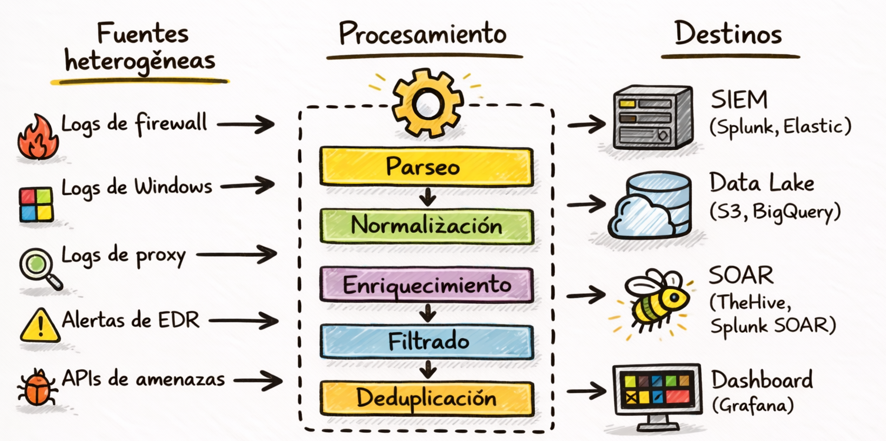
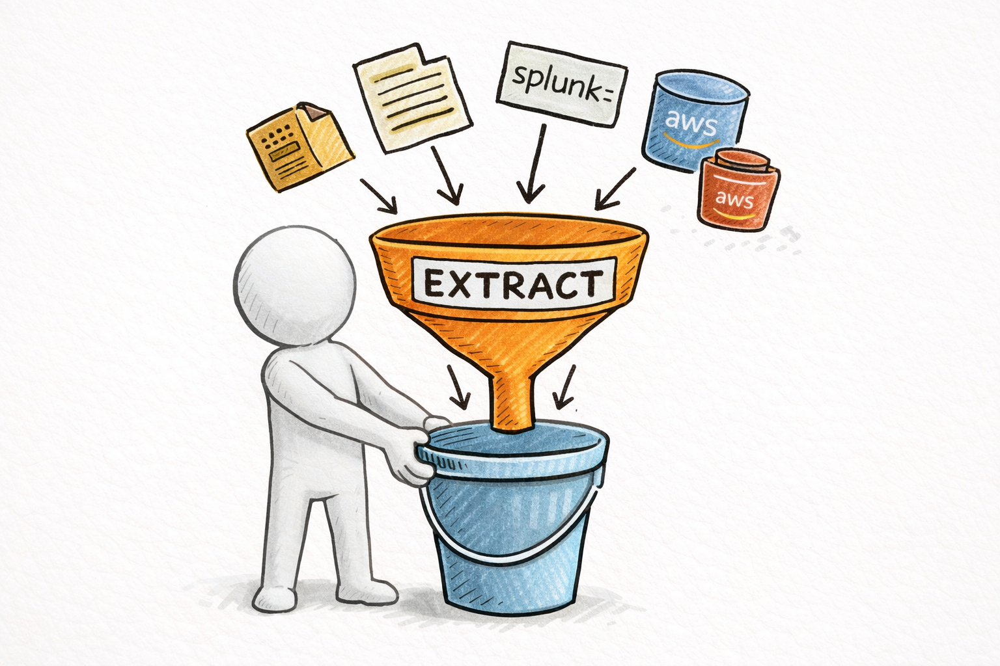
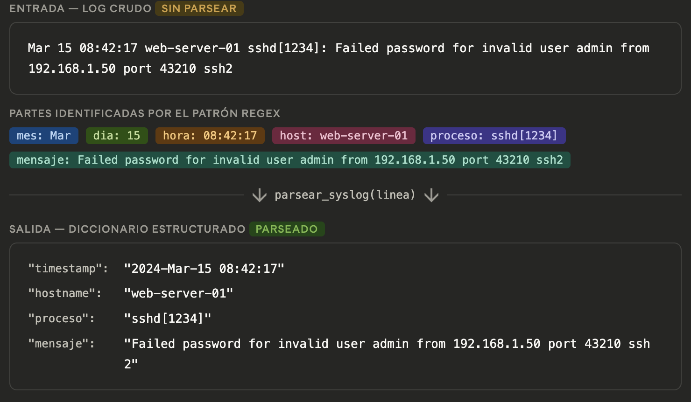
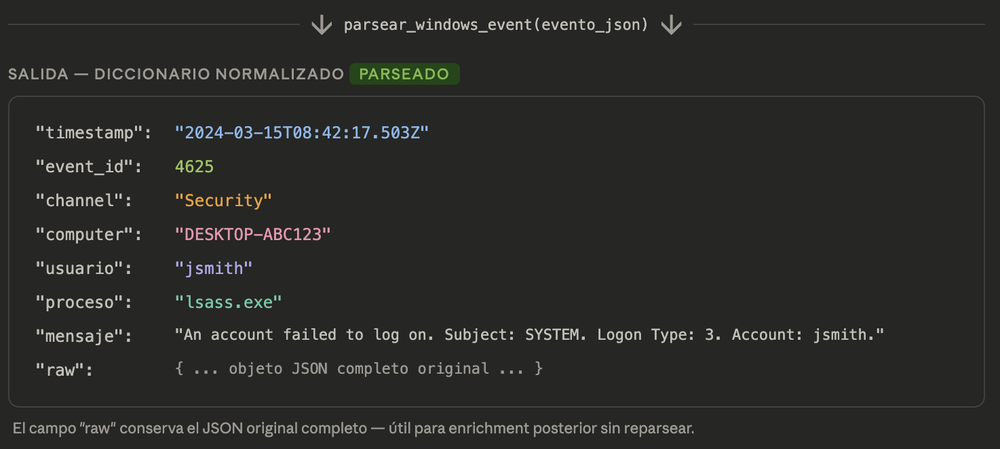
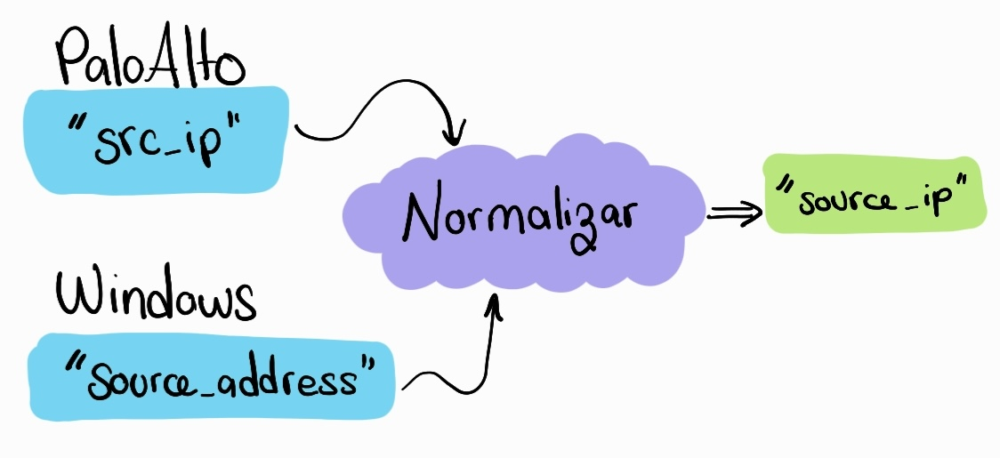
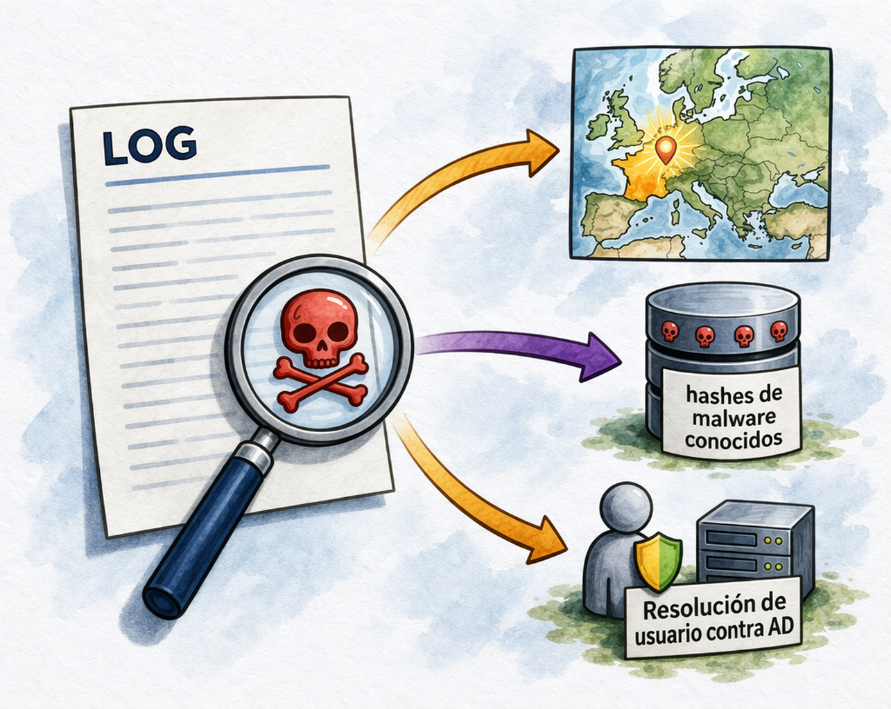

# ETL en Entornos de Seguridad: Extract, Transform, Load

El término ETL viene del mundo de los datos, pero describe exactamente lo que hace un analista de SOC todo el día sin saberlo. Cada vez que tomás un log de un firewall, lo parseas, le agregás contexto y lo mandás al SIEM, estás ejecutando un pipeline ETL. La diferencia entre hacerlo manualmente y hacerlo con un pipeline bien diseñado es la diferencia entre procesar 100 eventos por hora y 100.000.

---

## 1. ¿Qué es ETL y por qué existe en seguridad?

**Extract, Transform, Load** es el proceso de: extraer datos de fuentes heterogéneas, transformarlos y cargarlos en diferentes destinos.



Sin ETL, cada herramienta en el SOC habla un idioma diferente. El SIEM tiene logs en formato A, el EDR en formato B, el firewall en formato C. Correlacionar eventos de fuentes distintas es imposible si primero no los normalizás a un esquema común.

La seguridad tiene características específicas que hacen al ETL más complejo que en otros dominios:
- **Volumen masivo**: millones de eventos por hora en organizaciones grandes
- **Tiempo real**: un pipeline de seguridad que tarde 10 minutos en procesar es inútil
- **Heterogeneidad extrema**: formatos propietarios de decenas de vendors
- **Criticidad**: perder o corromper un evento puede significar perder evidencia de un incidente

---

## 2. Extract: de dónde salen los datos

La fase de Extract es donde tu pipeline conecta con todas las fuentes de datos del SOC. Puede ser un archivo de log que descargaste, una API de Splunk, una cola SQS en AWS, o archivos en S3. El desafío es que cada fuente tiene su propio formato, su propio método de acceso. El Extract tiene que ser agnóstico: debería poder traer datos de cualquier lado de forma confiable y eficiente.



Fuentes comunes en el SOC:
1. Archivos de log locales
2. API REST de un SIEM/EDR
3. Cola de mensajes (Kafka, SQS)
4. S3 / Data Lake

### Lectura eficiente de archivos grandes

En seguridad, los archivos de log pueden pesar varios GB. Un error clásico es hacer `df = pd.read_csv("logs_gigantes.csv")` porque  esto carga todo en memoria, puede crashear tu proceso y es muy lento. 

En su lugar, necesitás procesar en chunks: lees un pedazo, lo procesas, lo descartas, lees el siguiente. Esto mantiene el uso de RAM constante sin importar cuán grande sea el archivo.

```python
import pandas as pd

# ❌ MAL: carga todo el archivo en RAM (puede matar el proceso)
df = pd.read_csv("logs_gigantes.csv")

# ✅ BIEN: procesar en chunks de 10.000 filas
for chunk in pd.read_csv("logs_gigantes.csv", chunksize=10_000):
    chunk_filtrado = chunk[chunk["severity"] == "CRITICAL"]
    procesar(chunk_filtrado)

# ✅ BIEN para NDJSON (Newline-Delimited JSON): línea por línea
def leer_ndjson(ruta):
    with open(ruta, "r") as f:
        for linea in f:
            yield json.loads(linea)

# ✅ BIEN para Parquet (formato columnar, muy eficiente):
import pyarrow.parquet as pq
dataset = pq.read_table("security_events.parquet",
                         columns=["timestamp", "src_ip", "event_type", "severity"])
df = dataset.to_pandas()
```

**NDJSON y Parquet** son los formatos más comunes en pipelines de seguridad modernos:
- **NDJSON**: cada línea es un JSON independiente, perfecto para streaming y logs
- **Parquet**: formato columnar binario, 10-50x más rápido para consultas analíticas que CSV

---

## 3. Transform: convertir ruido en datos utilizables


El Transform es la etapa más compleja y más valiosa. Aquí es donde los datos heterogéneos se convierten en información estructurada y accionable. El objetivo es tomar la salsa de eventos de múltiples vendors, cada uno con su propio formato, y convertirlo en un esquema normalizado que puedas analizar de forma uniforme. Sin esta fase, tu SIEM termina con múltiples dialects, y correlacionar eventos entre fuentes distintas es prácticamente imposible.

### 3.1 Parseo: extraer estructura del texto

El parseo es el primer paso del Transform. Su objetivo es tomar logs que vienen como texto y separar sus partes para convertirlos en datos más ordenados.


Parsear es **leer un formato crudo y convertirlo en campos claros**. Esto es importante porque, mientras el log siga siendo solo texto, es mucho más difícil buscar, filtrar o correlacionar eventos después.

Por ejemplo, de una línea de syslog se puede sacar la fecha, el host, el proceso y el mensaje. 

```python
import re
from datetime import datetime

# ─── Parser de Syslog ───────────────────────────────────────────────────────
SYSLOG_PATTERN = re.compile(
    r"(?P<mes>\w+)\s+(?P<dia>\d+)\s+(?P<hora>\d{2}:\d{2}:\d{2})\s+"
    r"(?P<host>\S+)\s+(?P<proceso>[^:]+):\s+(?P<mensaje>.+)"
)

def parsear_syslog(linea):
    match = SYSLOG_PATTERN.match(linea)
    if not match:
        return {"raw": linea, "parse_error": True}
    datos = match.groupdict()
    return {
        "timestamp": f"2024-{datos['mes']}-{datos['dia']} {datos['hora']}",
        "hostname": datos["host"],
        "proceso": datos["proceso"].strip(),
        "mensaje": datos["mensaje"]
    }
```

Ejemplo:



En un evento de Windows se pueden extraer campos como el usuario, el equipo o el ID del evento. 

```python

# ─── Parser de Windows Event Log (formato JSON de Winlogbeat) ─────────────
def parsear_windows_event(evento_json):
    """Normaliza eventos de Windows exportados via Winlogbeat/Sysmon"""
    return {
        "timestamp": evento_json.get("@timestamp"),
        "event_id": evento_json.get("winlog", {}).get("event_id"),
        "channel": evento_json.get("winlog", {}).get("channel"),
        "computer": evento_json.get("winlog", {}).get("computer_name"),
        "usuario": evento_json.get("winlog", {}).get("user", {}).get("name"),
        "proceso": evento_json.get("process", {}).get("name"),
        "mensaje": evento_json.get("message", ""),
        "raw": evento_json
    }
```

Ejemplo:
```json
"@timestamp": "2024-03-15T08:42:17.503Z", 
"winlog": { 
	"event_id": 4625, 
	"channel": "Security", 
	"computer_name": "DESKTOP-ABC123", 
	"provider_name": "Microsoft-Windows-Security-Auditing", 
	"record_id": 8821043, 
	"task": "Logon",
	"keywords": ["Audit Failure"], 
	"user": { 
		"name": "jsmith", 
		"domain": "CORP", 
		"type": "User" 
	}, 
	"event_data": { 
		"LogonType": "3", 
		"FailureReason": "Unknown user name or bad password", 
		"IpAddress": "192.168.10.45", 
		"IpPort": "51322" 
	}
}, 
"process": { "name": "lsass.exe", "pid": 748 }, 
"host": { 
	"os": { "name": "Windows Server 2019" }, 
	"ip": ["10.0.1.15"]
}, 
"message": "An account failed to log on. Subject: SYSTEM. Logon Type: 3. Account: jsmith.", 
"agent": { 
	"version": "8.12.0", 
	"type": "winlogbeat"
}
```



Y en un log de firewall se pueden identificar datos como IP origen, IP destino, puertos y acción.

```python
# ─── Parser de logs de firewall Palo Alto ────────────────────────────────
PALO_ALTO_FIELDS = ["receive_time", "serial", "type", "subtype",
                     "src_ip", "dst_ip", "src_port", "dst_port",
                     "action", "bytes_sent", "bytes_recv", "app"]

def parsear_palo_alto_csv(linea_csv):
    """Parsea una línea de log CSV de Palo Alto"""
    campos = linea_csv.split(",")
    if len(campos) < len(PALO_ALTO_FIELDS):
        return None
    evento = dict(zip(PALO_ALTO_FIELDS, campos[:len(PALO_ALTO_FIELDS)]))
    # Convertir campos numéricos
    for campo in ["src_port", "dst_port", "bytes_sent", "bytes_recv"]:
        try:
            evento[campo] = int(evento[campo])
        except (ValueError, KeyError):
            evento[campo] = 0
    return evento
```

### 3.2 Normalización: un esquema común para todo

Una vez parseado, necesitás convertir cada evento a un esquema normalizado. Esto significa que sin importar si viene de Palo Alto, Windows o CrowdStrike, los campos clave se llaman siempre igual. Palo Alto llama "src_ip", Windows podría llamarlo "source_address": normalizás los dos a "source_ip". Esto hace que después, en la fase de Load o en tu análisis, podés escribir reglas una sola vez que funcionan para todos los vendors.



Los estándares más usados en la industria son:
- **ECS (Elastic Common Schema)** — el estándar de Elastic/OpenSearch, muy adoptado en entornos con Elasticsearch o Kibana
- **OCSF (Open Cybersecurity Schema Framework)** — un estándar más vendor-neutral, impulsado por AWS, Splunk, CrowdStrike y otros, diseñado para entornos multi-cloud y multi-vendor

Podés usar cualquiera de los dos o crear el tuyo. La clave es: **un esquema centralizado, todo va a él**:

```python
# Esquema normalizado (inspirado en ECS - Elastic Common Schema)
ESQUEMA_NORMALIZADO = {
    "timestamp": None,         # ISO 8601: "2024-03-18T14:32:15Z"
    "event_type": None,        # "network", "process", "auth", "file"
    "event_action": None,      # "allowed", "blocked", "created", "deleted"
    "source_ip": None,
    "dest_ip": None,
    "source_port": None,
    "dest_port": None,
    "hostname": None,
    "username": None,
    "process_name": None,
    "process_hash": None,
    "severity": None,          # "low", "medium", "high", "critical"
    "vendor": None,            # "palo_alto", "crowdstrike", "windows"
    "raw": None                # evento original sin modificar
}

def normalizar_palo_alto(evento_raw):
    return {
        **ESQUEMA_NORMALIZADO,
        "timestamp": evento_raw.get("receive_time"),
        "event_type": "network",
        "event_action": evento_raw.get("action"),
        "source_ip": evento_raw.get("src_ip"),
        "dest_ip": evento_raw.get("dst_ip"),
        "source_port": evento_raw.get("src_port"),
        "dest_port": evento_raw.get("dst_port"),
        "hostname": evento_raw.get("serial"),
        "severity": "high" if evento_raw.get("action") == "deny" else "low",
        "vendor": "palo_alto",
        "raw": evento_raw
    }

def normalizar_windows_event(evento_raw):
    severidad_map = {4625: "medium", 4648: "high", 4720: "high", 4688: "low"}
    event_id = evento_raw.get("event_id", 0)
    return {
        **ESQUEMA_NORMALIZADO,
        "timestamp": evento_raw.get("timestamp"),
        "event_type": "auth" if event_id in [4625, 4648] else "process",
        "event_action": "login_failed" if event_id == 4625 else "process_created",
        "hostname": evento_raw.get("computer"),
        "username": evento_raw.get("usuario"),
        "process_name": evento_raw.get("proceso"),
        "severity": severidad_map.get(event_id, "low"),
        "vendor": "windows",
        "raw": evento_raw
    }

# Router: decide qué normalizador usar
NORMALIZADORES = {
    "palo_alto": normalizar_palo_alto,
    "windows": normalizar_windows_event,
}

def normalizar(evento, vendor):
    normalizador = NORMALIZADORES.get(vendor)
    if not normalizador:
        return {**ESQUEMA_NORMALIZADO, "vendor": vendor, "raw": evento}
    return normalizador(evento)
```

### 3.3 Enriquecimiento: agregar contexto



Una IP que viene en un evento normalizado es solo un número. Enriquecer significa: ¿de qué país viene esa IP? ¿A qué ASN pertenece? ¿Está en alguna lista negra que nosotros mantenemos? ¿Es una dirección interna o externa? El enriquecimiento agrega este contexto. 

Consejo: si consultas una API externa para cada IP, tu pipeline se vuelve muy lento. Por eso el código usa un **cache en memoria** ... si ya consultaste esa IP una vez, la próxima vez usás el resultado en cache.

```python
from functools import lru_cache

# Cache para no consultar lo mismo múltiples veces
@lru_cache(maxsize=10000)
def obtener_geo_ip(ip):
    """Obtiene país/ASN de una IP (con cache en memoria)"""
    if ip.startswith(("192.168.", "10.", "172.16.")):
        return {"pais": "INTERNO", "asn": "PRIVADO"}
    response = requests.get(f"https://ipapi.co/{ip}/json/", timeout=5)
    if response.ok:
        data = response.json()
        return {"pais": data.get("country_name"), "asn": data.get("org")}
    return {"pais": "DESCONOCIDO", "asn": "DESCONOCIDO"}

def enriquecer_evento(evento_normalizado, lista_negra_ips):
    """Agrega contexto a un evento normalizado"""
    evento = evento_normalizado.copy()

    # Geo IP para IPs externas
    if evento.get("source_ip"):
        geo = obtener_geo_ip(evento["source_ip"])
        evento["source_country"] = geo["pais"]
        evento["source_asn"] = geo["asn"]

    # Verificar contra lista negra interna
    if evento.get("source_ip") in lista_negra_ips:
        evento["en_lista_negra"] = True
        evento["severity"] = "critical"
    else:
        evento["en_lista_negra"] = False

    return evento
```

### 3.4 Filtrado y deduplicación


En un SOC grande, millones de eventos por hora es normal. No todos son interesantes. El ruido es abrumador: tráfico de monitoreo, health checks legítimos, eventos de baja severidad de sistemas conocidos. El filtrado elimina los que sabés que no importan. 

La deduplicación es igual de importante: si el mismo evento fue generado 1000 veces en el último minuto (por ejemplo, porque un sistema está en loop), querés guardar solo uno. Las clases de deduplicación pueden ser simples (mismo IP, mismo puerto, misma acción) o complejas (según reglas específicas del vendor).

```python
from collections import deque
import hashlib

class FiltroEventos:
    """Filtra ruido y deduplica eventos en un pipeline de seguridad"""

    def __init__(self, ventana_dedup_segundos=300):
        self.ventana = ventana_dedup_segundos
        self.vistos = deque()  # hashes de eventos recientes

    def _hash_evento(self, evento):
        """Genera fingerprint único de un evento"""
        clave = f"{evento.get('source_ip')}|{evento.get('dest_ip')}|{evento.get('event_action')}"
        return hashlib.md5(clave.encode()).hexdigest()

    def es_duplicado(self, evento):
        hash_e = self._hash_evento(evento)
        if hash_e in self.vistos:
            return True
        self.vistos.append(hash_e)
        if len(self.vistos) > 100000:  # limpiar memoria
            self.vistos.popleft()
        return False

    def debe_filtrar(self, evento):
        """Reglas de filtrado para reducir ruido"""
        # Ignorar tráfico interno de monitoreo
        if evento.get("source_ip") == "monitoring.internal":
            return True
        # Ignorar eventos de baja severidad de fuentes confiables
        if evento.get("severity") == "low" and evento.get("source_country") == "INTERNO":
            return True
        return False
```

---

## 4. Load: llevar los datos a donde deben estar


Una vez transformados y enriquecidos, los eventos van a múltiples destinos. Algunos van al SIEM (Elasticsearch, Splunk) para búsqueda en tiempo real. Otros van a un data lake en S3 o formato Parquet para análisis histórico. Los eventos críticos van directamente al SOAR para crear casos. El Load es simple comparado con el Transform, pero es crítico hacerlo de forma eficiente: no querés que un fallo en la carga deje eventos sin procesar.

```python
import elasticsearch
from elasticsearch import Elasticsearch

# ─── Cargar a Elasticsearch / OpenSearch ────────────────────────────────────
def cargar_a_elasticsearch(eventos, index_nombre):
    """Carga eventos normalizados a Elasticsearch en bulk"""
    from elasticsearch.helpers import bulk
    es = Elasticsearch(["http://localhost:9200"])

    acciones = [
        {
            "_index": index_nombre,
            "_source": evento
        }
        for evento in eventos
    ]
    exito, errores = bulk(es, acciones, raise_on_error=False)
    return exito, errores

# ─── Cargar a un archivo Parquet (data lake local) ──────────────────────────
def cargar_a_parquet(eventos, ruta_salida):
    """Guarda eventos en formato Parquet columnar"""
    import pandas as pd
    df = pd.DataFrame(eventos)
    df.to_parquet(ruta_salida, index=False, compression="snappy")
    print(f"Guardado {len(df)} eventos en {ruta_salida}")

# ─── Cargar a una cola SOAR (webhook) ───────────────────────────────────────
def cargar_a_soar(eventos_criticos, webhook_url):
    """Envía solo los eventos críticos al SOAR para crear casos"""
    for evento in eventos_criticos:
        payload = {
            "type": "alert",
            "title": f"[ETL] {evento['event_type']} - {evento['source_ip']}",
            "severity": evento["severity"],
            "details": evento
        }
        response = requests.post(webhook_url, json=payload)
        if not response.ok:
            logger.error(f"Fallo al enviar evento al SOAR: {response.text}")
```

---

## 5. Pipeline completo: juntando todo

Hasta acá mostramos cada pieza por separado. Ahora miramos cómo funciona todo junto en un pipeline de verdad. El flow es: extrae eventos (pueden venir de muchas fuentes), para cada evento lo parseas según su vendor, lo normalizas, lo filtras, lo enriqueces, luego lo cargás a los destinos apropiados. El logging es crítico en todo el ciclo para poder debuguear problemas después.

```python
def pipeline_etl_soc(fuente_config, destino_config):
    """
    Pipeline ETL completo para un SOC.
    Extrae, transforma y carga eventos de seguridad.
    """
    logger = configurar_logger("pipeline_etl")
    filtro = FiltroEventos()
    lista_negra = cargar_lista_negra()
    eventos_procesados = []
    eventos_criticos = []

    # ── EXTRACT ─────────────────────────────────────────────────────────────
    logger.info(f"Iniciando extracción desde {fuente_config['tipo']}")
    if fuente_config["tipo"] == "archivo":
        eventos_raw = extraer_desde_archivo_log(fuente_config["ruta"])
    elif fuente_config["tipo"] == "api":
        eventos_raw = extraer_desde_api_siem(**fuente_config["params"])
    elif fuente_config["tipo"] == "sqs":
        eventos_raw = extraer_desde_sqs(fuente_config["queue_url"])

    for evento_raw in eventos_raw:
        try:
            # ── TRANSFORM ──────────────────────────────────────────────────
            # 1. Parsear según el vendor
            vendor = fuente_config.get("vendor", "desconocido")
            evento_parseado = parsear_segun_vendor(evento_raw, vendor)

            # 2. Normalizar al esquema común
            evento_normalizado = normalizar(evento_parseado, vendor)

            # 3. Filtrar ruido y duplicados
            if filtro.debe_filtrar(evento_normalizado):
                continue
            if filtro.es_duplicado(evento_normalizado):
                continue

            # 4. Enriquecer
            evento_enriquecido = enriquecer_evento(evento_normalizado, lista_negra)

            eventos_procesados.append(evento_enriquecido)

            if evento_enriquecido["severity"] in ("high", "critical"):
                eventos_criticos.append(evento_enriquecido)

        except Exception as e:
            logger.error(f"Error procesando evento: {e} | raw: {str(evento_raw)[:100]}")
            continue

    logger.info(f"Procesados: {len(eventos_procesados)} | Críticos: {len(eventos_criticos)}")

    # ── LOAD ────────────────────────────────────────────────────────────────
    cargar_a_elasticsearch(eventos_procesados, destino_config["es_index"])
    cargar_a_parquet(eventos_procesados, destino_config["parquet_path"])

    if eventos_criticos:
        cargar_a_soar(eventos_criticos, destino_config["soar_webhook"])

    return len(eventos_procesados)


# Ejecutar el pipeline
if __name__ == "__main__":
    pipeline_etl_soc(
        fuente_config={
            "tipo": "archivo",
            "ruta": "/var/log/firewall/paloalto.log",
            "vendor": "palo_alto"
        },
        destino_config={
            "es_index": "soc-events-2024.03",
            "parquet_path": "/data/lake/2024/03/18/firewall.parquet",
            "soar_webhook": "https://soar.company.com/api/alerts"
        }
    )
```

---

## 6. Orquestación: correr el pipeline automáticamente

Un pipeline ETL de seguridad no se ejecuta manualmente: corre de forma continua o programada. Una vez que lo escribís, querés que funcione sin intervención. Hay tres patrones principales, según la complejidad:

### Opción 1: cron job simple

```
crontab: */5 * * * * python /opt/soc/pipeline_etl.py >> /var/log/etl.log 2>&1
```

### Opción 2: loop continuo con intervalo

```python
import time

def correr_pipeline_continuo(intervalo_segundos=60):
    logger.info("Pipeline ETL iniciado en modo continuo")
    while True:
        try:
            n = pipeline_etl_soc(FUENTE_CONFIG, DESTINO_CONFIG)
            logger.info(f"Ciclo completado: {n} eventos procesados")
        except Exception as e:
            logger.critical(f"Pipeline falló: {e}")
        time.sleep(intervalo_segundos)
```

### Opción 3: Airflow / Prefect para pipelines complejos

Para organizaciones más maduras, un orquestador de workflows permite dependencias entre tareas, reintentos, alertas de fallo, etc.

