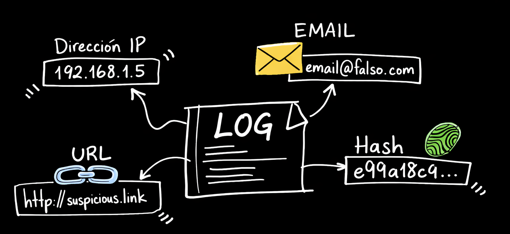

# Extracción de IOCs desde Texto

### **IOC (Indicator of Compromise)** 



un dato técnico concreto que indica que un sistema fue o podría estar comprometido. No es una descripción del ataque ni una hipótesis: es un artefacto observable y verificable. 

Ejemplos: 
* la IP `185.220.101.45` desde donde se conectó el atacante, 
* el hash SHA256 `a1b2c3...` del archivo de malware, 
* el dominio `evil-c2.net` al que se conectó el endpoint infectado.

Los IOCs son la moneda de cambio de la threat intelligence: se extraen de incidentes, se comparten entre organizaciones, y se usan para detectar la misma amenaza en otras redes.

**Tipos de IOC más comunes:** IPs, dominios, URLs, hashes de archivos (MD5/SHA1/SHA256), direcciones de email, CVEs, y técnicas MITRE ATT&CK (T1059, etc.).

Un analista recibe un email de phishing, un reporte de threat intel, un log de firewall, o la salida de un sandbox de malware. Dentro de ese texto hay IOCs. Encontrarlos manualmente en un texto largo es lento y propenso a errores. Automatizarlo con Python es directo y escalable.

La extracción de IOCs es el primer paso del pipeline de enriquecimiento: no podés consultar VirusTotal si primero no identificaste qué hashes extraer, ni podés bloquear IPs que no identificaste.

---

## 1. Tipos de IOCs y sus patrones

Los IOCs más comunes tienen patrones predecibles que se pueden capturar con expresiones regulares. Una IP siempre es cuatro números entre 0 y 255 separados por puntos, un SHA256 siempre es exactamente 64 caracteres hexadecimales, un CVE siempre tiene el formato `CVE-YYYY-NNNNN`. Estos patrones son fijos, y Python puede buscarlos automáticamente.

```python
import re

PATRONES = {
    "ipv4":   re.compile(r"\b(?:(?:25[0-5]|2[0-4]\d|[01]?\d\d?)\.){3}(?:25[0-5]|2[0-4]\d|[01]?\d\d?)\b"),
    "md5":    re.compile(r"\b[0-9a-fA-F]{32}\b"),
    "sha256": re.compile(r"\b[0-9a-fA-F]{64}\b"),
    "url":    re.compile(r"https?://[a-zA-Z0-9\-._~:/?#\[\]@!$&\'()*+,;=%]+"),
    "email":  re.compile(r"\b[a-zA-Z0-9._%+\-]+@[a-zA-Z0-9.\-]+\.[a-zA-Z]{2,}\b"),
    "cve":    re.compile(r"\bCVE-\d{4}-\d{4,7}\b", re.IGNORECASE),
    "mitre":  re.compile(r"\bT\d{4}(?:\.\d{3})?\b"),
}
```

Cada patrón tiene su particularidad:
- **IPs**: el regex verifica que cada octeto esté entre 0 y 255, no cualquier número de 3 dígitos
- **Hashes**: se distinguen por longitud exacta (32 / 40 / 64 caracteres hex). Hay que tener cuidado de no confundir subcadenas — un SHA256 contiene subcadenas que matchean como SHA1 o MD5
- **Dominios**: son más difíciles que IPs porque cualquier texto con punto puede parecer un dominio. Hay que filtrar dominios de la whitelist (google.com, microsoft.com) que aparecen en todos los reportes pero no son IOCs
- **CVE y MITRE**: los más simples — formatos fijos y únicos que no generan falsos positivos

---

## 2. Qué hace un extractor de IOCs

La lógica de extracción hace más que solo aplicar los regex. Para cada tipo de IOC hay trabajo adicional:

**Normalización del texto (defanging):** los analistas de threat intel a veces "rompen" los IOCs en los reportes para que no sean clickeables: `hxxp://` en lugar de `http://`, `evil[.]com` en lugar de `evil.com`. Antes de aplicar los regex hay que revertir eso.

**Filtrado de falsos positivos:**
- IPs privadas (`10.x.x.x`, `192.168.x.x`, `172.16.x.x`) no son IOCs — son infraestructura interna
- Dominios legítimos conocidos (google.com, microsoft.com, github.com) aparecen en todos los reportes como referencias, no como indicadores maliciosos

**Deduplicación:** un mismo hash puede aparecer 10 veces en un reporte. El extractor devuelve cada IOC una sola vez.

**Jerarquía entre tipos:** si un SHA256 matchea, sus subcadenas no deben contarse como SHA1 o MD5 por separado.

---

## 3. Casos de uso


La extracción de IOCs es útil en varios contextos del SOC:

- **Correos de phishing**: sacar dominios, URLs, emails del atacante y hashes de adjuntos
- **Reportes de threat intelligence**: extraer indicadores de una campaña APT para cargarlos en detecciones
- **Análisis de malware**: obtener hashes, dominios de C2, IPs de un reporte de sandbox
- **Alertas del SIEM o EDR**: tomar los IOCs de una alerta y enriquecerlos automáticamente
- **Búsqueda retrospectiva**: usar IOCs extraídos para ver si ya aparecieron antes en la red

---

## 4. Conectar extracción con enriquecimiento

La extracción de IOCs no es un fin en sí mismo: es el primer paso de un pipeline más grande.

```
Texto (email / log / reporte)
        │
        ▼
   extraer_iocs()
        │
        ▼
  IPs, hashes, dominios
        │
        ▼
  VirusTotal / Shodan / MISP
        │
        ▼
  Score de riesgo → decisión
```

Una vez que tenés la lista de IOCs, consultás cada uno contra fuentes externas de threat intelligence. VirusTotal te dice si 58 de 73 motores marcaron ese hash como malware. Shodan te dice qué servicios expone esa IP. MISP te dice si esa IP ya estuvo asociada a una campaña conocida.

El score agregado de todos esos resultados determina la decisión: escalar a un analista, abrir un caso, o simplemente monitorear. La extracción convierte texto sin estructura en datos accionables.

---

## 5. Librería alternativa: `ioc-finder`

Escribir y mantener regex para cada tipo de IOC da control total, pero es tedioso. Para proyectos que necesitan extracción más robusta sin mantener los patrones manualmente, existe `ioc-finder`: una librería con patrones ya testeados por la comunidad.

```bash
pip install ioc-finder
```

```python
from ioc_finder import find_iocs

texto = "Connecting to C2 at 185.220.101.45. Hash: a1b2c3...64chars. Domain: evil-payload.net"

iocs = find_iocs(texto)
print(iocs['ipv4s'])    # ['185.220.101.45']
print(iocs['sha256s'])  # ['a1b2c3...']
print(iocs['domains'])  # ['evil-payload.net']
```

`ioc-finder` maneja automáticamente defanging, validación de IPs privadas, deduplicación, y tipos extra como Bitcoin addresses o YARA rules.

La diferencia práctica: para extracción rápida en scripts, `ioc-finder` es conveniente. Para un pipeline de producción donde necesitás control total sobre los patrones y la lógica de filtrado, el enfoque con regex propios es más mantenible.

Los IOCs que extraés acá son exactamente los que vas a enriquecer en la clase de conectores: una vez que tenés la IP, el hash o el dominio identificados, el paso siguiente es consultarlos contra VirusTotal, Shodan y otras fuentes para entender si representan una amenaza real.
