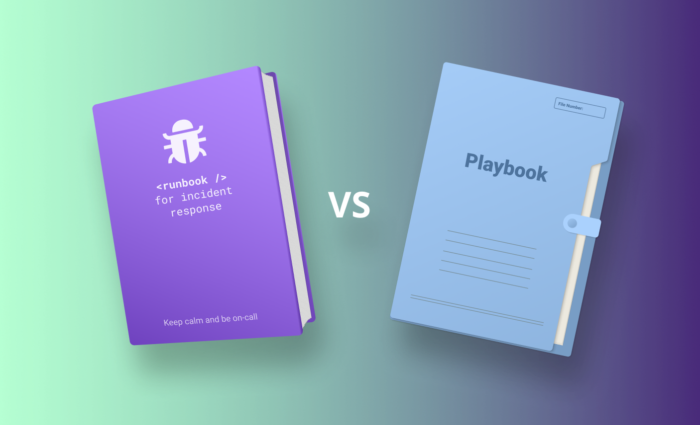

# Playbooks Automatizados y Runbooks

## 1. Runbooks: el punto de partida



Antes de la automatización, los equipos de seguridad trabajaban con **runbooks**: documentos que describen paso a paso qué hacer ante un tipo de incidente. 

Por ejemplo, un runbook de fuerza bruta en RDP le dice al analista "primero anotá la IP origen, después buscála en los logs históricos, después bloqueala en el firewall, después forzá un cambio de contraseña...".

Los runbooks capturan el conocimiento del equipo. Si un analista senior resolvió 50 veces el mismo tipo de incidente, puede escribir ese conocimiento en un runbook para que cualquier analista pueda seguirlo correctamente.

El problema es la escala. Ejecutar un runbook a mano para cada alerta toma horas. El analista termina copiando y pegando IPs en VirusTotal, buscando manualmente en logs, creando tickets de forma repetitiva: trabajo mecánico que no requiere juicio humano pero consume todo el tiempo disponible.

El paso natural es preguntarse: **¿qué partes de este runbook puede ejecutar una máquina?**

---

## 2. De runbook a playbook

Un **playbook** es el mismo proceso del runbook pero **automatizado y ejecutable**. Cada paso que antes hacía el analista se convierte en una función que el sistema ejecuta solo.

Tomemos un runbook de fuerza bruta en RDP:

```
RUNBOOK: Responder a Intento de Fuerza Bruta en RDP
=========================================================

PASO 1: Obtener información del incidente
- Registrá la IP origen del ataque
- Registrá el usuario siendo atacado
- Registrá la cantidad de intentos fallidos

PASO 2: Verificar si la IP es conocida
- Buscá la IP en el CMDB (base de datos de configuración)
- Si es una IP de una oficina conocida, considerá falso positivo

PASO 3: Tomar acciones de mitigación
- Bloqueá la IP en el firewall
- Forzá cambio de contraseña para el usuario atacado

PASO 4: Investigar causas raíz
- ¿El atacante logró acceso exitoso en algún momento?
- Si sí → escalar a CRITICAL

PASO 5: Documentar y escalar
- Creá un ticket en el sistema de gestión de incidentes
- Notificá al propietario del servidor
```

El playbook equivalente ejecuta esos mismos pasos automáticamente:

```python
# Pseudocódigo — cada paso del runbook se convierte en código
def responder_a_fuerza_bruta_rdp(ip_origen, usuario_objetivo, intentos):

    incidente = crear_caso(tipo="Fuerza Bruta RDP", 
						    ip=ip_origen, 
						    usuario=usuario_objetivo)

    # PASO 2: ¿IP conocida?
    if consultar_cmdb(ip_origen):
        incidente.cerrar(razon="IP conocida, falso positivo probable")
        return

    # PASO 3: Mitigar
    bloquear_ip_en_firewall(ip_origen)
    forzar_cambio_password(usuario_objetivo)

    # PASO 4: ¿Hubo acceso exitoso?
    if historial_contiene_acceso_exitoso(usuario_objetivo):
        incidente.prioridad = "CRITICAL"

    # PASO 5: Documentar
    crear_ticket_jira(incidente)
    notificar_dueno_servidor(usuario_objetivo)
```

Lo que antes tomaba 30 minutos de trabajo manual se ejecuta en 2-3 segundos. Y lo más importante: el analista ya no gasta tiempo en los pasos mecánicos, recibe el caso ya enriquecido, con la IP bloqueada y el ticket creado, y solo tiene que tomar la decisión de juicio que la máquina no puede tomar sola.

---

## 3. Playbooks automatizados: estructura

Un **playbook automatizado** contiene lógica, condicionales e integraciones con herramientas que se ejecutan sin intervención humana en la mayor parte del flujo.

Los mejores playbooks incluyen el **"human-in-the-loop"** en los puntos de decisión críticos. No todo se automatiza completamente: el playbook puede ejecutar toda la investigación y el enriquecimiento automáticamente, pero pausarse para que un analista decida si aislar el endpoint (una acción irreversible) o solo monitorear.

Estructura de un playbook:

1. **Trigger**: qué evento lo inicia. "Si una alerta de tipo Suspicious Login se recibe"
2. **Input**: qué datos necesita. usuario, IP de origen, timestamp
3. **Acciones**: qué ejecuta. Consultar VirusTotal, bloquear usuario, crear ticket
4. **Decisiones**: condicionales que determinan el flujo. "Si la IP es maliciosa, aislar el endpoint"
5. **Output**: qué produce. Caso cerrado automáticamente, o escalado al analista

Un playbook típico de respuesta a phishing:

```
TRIGGER: Alerta de email sospechoso recibida
  ↓
INPUT: Email object con remitente, asunto, URLs, adjuntos
  ↓
ACCIÓN 1: Extraer todas las URLs del email
  ↓
ACCIÓN 2: Extraer todos los hashes de archivos adjuntos
  ↓
ACCIÓN 3: Consultar cada URL en VirusTotal y URLhaus
  ↓
ACCIÓN 4: Consultar cada hash en VirusTotal
  ↓
DECISIÓN: ¿Alguna URL o hash es malicioso?
  │
  ├─ SÍ → ACCIÓN 5a: Bloquear email en el gateway
  │        ACCIÓN 6a: Crear caso HIGH priority en SOAR
  │        ACCIÓN 7a: Notificar al usuario
  │        RESULTADO: Caso escalado a analista
  │
  └─ NO → ACCIÓN 5b: Email es probablemente limpio
           DECISIÓN 2: ¿Qué tan sospechoso es el email?
           │
           ├─ MUY SOSPECHOSO → Crear caso LOW priority
           │
           └─ PROBABLEMENTE SEGURO → Cerrar caso automáticamente
```

---

## 4. Ciclo de vida de un incidente automatizado

Un incidente típico en un SOAR sigue este ciclo:

**FASE 1: DETECCIÓN**
- Alerta llega desde SIEM, EDR, firewall, o cualquier sensor
- SOAR recibe la alerta automáticamente

**FASE 2: TRIAJE AUTOMÁTICO** 
- El SOAR ejecuta un playbook de "pre-análisis"
- Enriquece la alerta consultando múltiples fuentes:
  - VirusTotal para IPs/dominios/hashes sospechosos
  - MISP para inteligencia compartida
  - CMDB para contexto sobre el activo afectado
  - Logs históricos del SIEM para comportamiento anterior del usuario
- Calcula un **scoring de riesgo** basado en toda la evidencia

**FASE 3: DECISIÓN AUTOMÁTICA** 
- Basándose en el scoring, el SOAR toma una decisión:
  - Riesgo alto → Crear caso HIGH priority y ejecutar playbook de respuesta
  - Riesgo medio → Crear caso MEDIUM priority y pausar para revisión humana
  - Riesgo bajo → Crear caso LOW priority o resolver automáticamente
  - Falso positivo detectado → Cerrar automáticamente

**FASE 4: RESPUESTA AUTOMÁTICA** (si es necesario)
- Ejecutar acciones automatizadas según tipo de incidente:
  - Phishing → Bloquear email, notificar usuario, crear ticket
  - Malware → Aislar endpoint, recolectar evidencia, notificar CISO
  - Fuerza bruta → Bloquear IP, resetear password, revisar logs
  - Acceso no autorizado → Deshabilitar cuenta, alertar equipo

**FASE 5: REVISIÓN HUMANA** (si es necesario)
- Si el caso no fue cerrado automáticamente:
  - Un analista revisa la evidencia y el razonamiento automático
  - Analista puede aprobar acciones propuestas o tomar acciones diferentes
  - Analista documenta sus hallazgos

**FASE 6: REMEDIACIÓN ADICIONAL**
- Si se confirma un incidente:
  - Pasos de remediación más agresivos si es necesario
  - Investigación de alcance (¿otros usuarios afectados?)
  - Caza de amenazas (threat hunting) para detectar movimiento lateral

**FASE 7: CIERRE Y APRENDIZAJE** 
- Caso cerrado con documentación completa
- Análisis post-incidente: ¿por qué sucedió? ¿cómo prevenirlo?
- Actualizar playbooks si se descubrieron gaps
- Actualizar reglas de detección si fuera necesario


