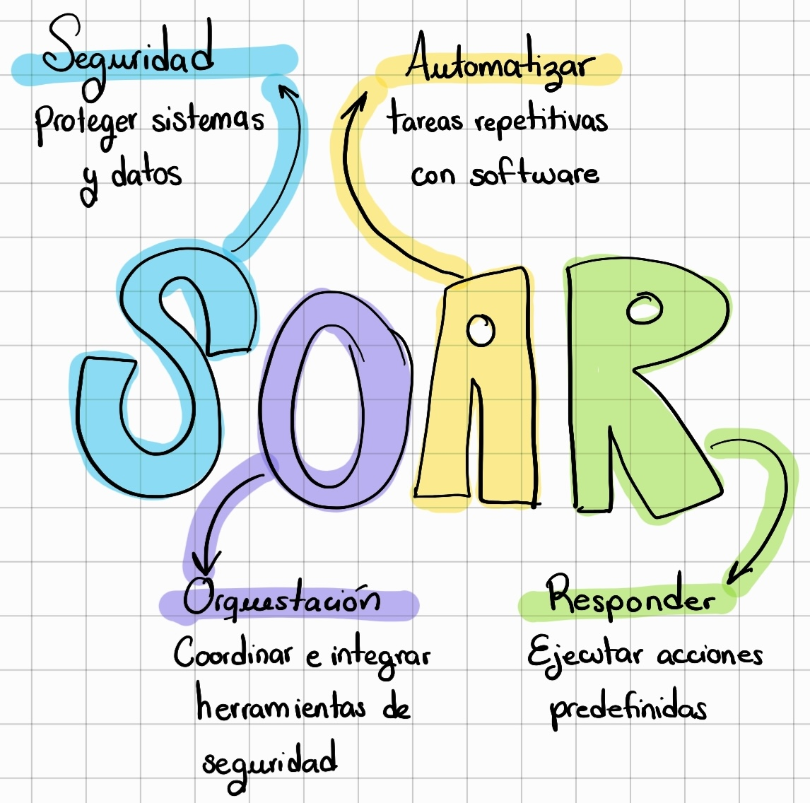

# Plataformas SOAR: Tipos, Criterios y Selección

## 1. Qué es un SOAR

**SOAR** (Security Orchestration, Automation and Response) es la plataforma que permite ejecutar los playbooks. Si el playbook es el plan, el SOAR es el sistema que lo ejecuta automáticamente cuando llega una alerta.

Las tres funciones que nombra el acrónimo:

- **Orchestration (Orquestación):** conecta herramientas del stack de seguridad (SIEM, EDR, firewall, directorio activo, sistemas de tickets) y coordina que trabajen juntas dentro de un flujo automatizado.
- **Automation (Automatización):** ejecuta acciones sin intervención humana: consultar VirusTotal, bloquear una IP, resetear una contraseña, abrir un ticket.
- **Response (Respuesta):** gestiona el ciclo completo del incidente, desde la detección hasta el cierre, trazando cada acción tomada.

Un SOC sin SOAR procesa las alertas manualmente, una por una. Un SOC con SOAR procesa la mayoría automáticamente y escala al analista solo lo que requiere juicio humano.

---

## 2. Tres categorías que siempre existirán

El mercado SOAR cambia constantemente: plataformas que eran líderes hace cinco años fueron adquiridas, renombradas o reemplazadas. Por eso, más que memorizar herramientas, lo importante es entender las **categorías** y los **criterios** para evaluar cualquier opción que exista cuando leas esto.

---

## 3. Tres categorías que siempre existirán

### Comerciales de nivel empresarial
Soluciones maduras de grandes proveedores de seguridad. Tienen cientos de integraciones pre-construidas, soporte con SLA, y suelen incluir ML para priorización de alertas. El precio es elevado y el vendor lock-in es real: cuanto más complejos tus playbooks, más caro es cambiar de plataforma.

**Aptas para:** organizaciones con presupuesto dedicado y muchos sistemas a integrar.

### Cloud-native integradas
SOAR como componente de una plataforma más grande (XDR, SIEM). Se integran profundamente con el resto del ecosistema del proveedor, pero son menos flexibles fuera de él.

**Aptas para:** organizaciones consolidadas en un solo ecosistema (mismo proveedor para SIEM + EDR + firewall).

### Open source y autohosteadas
Sin costo de licencia, código auditable, control total de los datos. A cambio, requieren capacidad técnica interna para desplegar, mantener y extender la plataforma.

**Aptas para:** equipos técnicos con recursos para operar infraestructura propia, o donde la privacidad de datos es crítica.

---

## 4. Open source SOAR y Python

Las plataformas open source son especialmente interesantes para aprender SOAR porque podés ver exactamente cómo funcionan por dentro. 

Algunas plataformas SOAR incluye:
* Shuffle, 
* TheHive + Cortex, 
* Iris, 
* OpenCTI

**Shuffle** es la plataforma que se usa en la demo del curso. Es una SOAR open source con interfaz visual de drag-and-drop: conectás bloques de acciones para armar playbooks sin escribir código para la lógica de flujo. Se instala con Docker en minutos y soporta ejecutar scripts Python en nodos del playbook. El repositorio del curso tiene la demo de integración con alertas.

La mayoría de las plataformas open source soportan Python de alguna manera:

| Mecanismo | Cómo funciona |
|:---|:---|
| **Apps / plugins Python** | Empaquetás código Python como un "conector" reutilizable en la interfaz visual |
| **Scripts inline** | Escribís Python directamente dentro de un nodo del playbook |
| **Webhooks + scripts externos** | El playbook llama a un endpoint que ejecuta tu script Python en cualquier servidor |
| **Integraciones vía API REST** | Tu código Python llama a la API de la plataforma para crear casos, agregar evidencia, etc. |

**¿La limitación?** Las plataformas open source tienen menos integraciones pre-construidas. Eso significa que probablemente tengas que escribir más Python vos mismo para conectar herramientas que en una plataforma comercial ya vendrían incluidas.

---
## 5. El principio que no cambia

> Una plataforma SOAR moderada, bien integrada con tu stack, entrega mucho más valor que la plataforma más potente del mercado mal configurada.

El factor decisivo no es el ranking de analistas: es qué tan bien se conecta con lo que ya tenés y qué tan rápido tu equipo puede operarla de forma autónoma.
