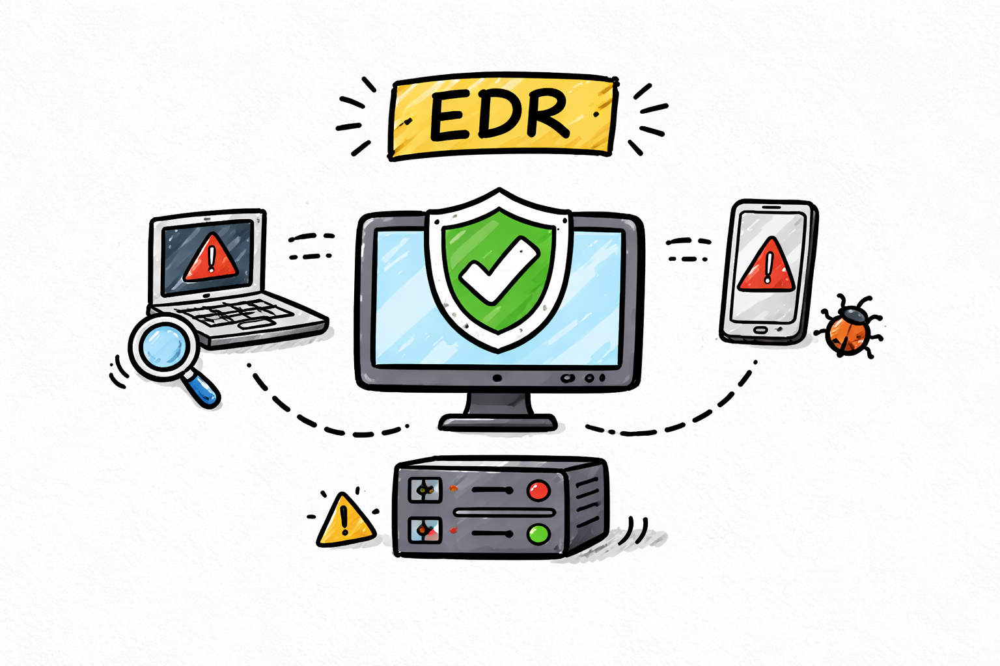

# Integración con el Stack de Seguridad

El poder real de un SOAR está en su capacidad de integrarse profundamente con las herramientas de seguridad ya en uso. Un SOAR bien integrado es el orquestador central que coordina respuesta a través de docenas de herramientas y sistemas.

Algunas herramientas con las que podemos integrarnos:
1. EDR (Endpoint Detection & Response)
2. Firewalls y controles de red
3. Sistemas de ticketing (ej: Jira, ServiceNow)
4. Plataformas de email
5. Active Directory y gestión de identidades
6. Plataformas de threat intelligence (ej: VirusTotal)

---

## 1. Integración con EDR (Endpoint Detection & Response)



El EDR (Endpoint Detection & Response) es los ojos y oídos en los endpoints. Herramientas como CrowdStrike Falcon, Microsoft Defender, SentinelOne o Carbon Black detectan actividad maliciosa en máquinas. Un SOAR integrado con EDR puede ejecutar investigación y contención automáticas.

**Lo que habilita la integración:**
- Cuando el EDR detecta algo, dispara una alerta al SOAR automáticamente
- El SOAR puede consultar el historial del dispositivo: "Dame todos los procesos ejecutados en la última hora"
- El SOAR puede ordenar acciones: aislar el dispositivo, matar un proceso, recolectar evidencia forense

**El flujo típico en un playbook:**

```python
# Pseudocódigo de un playbook de respuesta a malware
dispositivo = crowdstrike.obtener_info(device_id)
procesos    = crowdstrike.listar_procesos(device_id)

if es_ransomware(procesos):
    crowdstrike.aislar_dispositivo(device_id)   # corta red inmediatamente
    crowdstrike.recolectar_forense(device_id)   # memory dump, event logs
    crear_caso(prioridad="CRITICAL")
```

---

## 2. Integración con firewalls y controles de red


Los firewalls controlan qué tráfico entra y sale de la red. Un SOAR integrado puede bloquear IPs y dominios maliciosos en segundos, sin esperar que un analista entre manualmente al dashboard.

**Lo que habilita la integración:**
- Bloquear IPs y dominios detectados como maliciosos
- Crear reglas temporales que expiran automáticamente (sin dejar basura)
- Redirigir tráfico sospechoso a sistemas de análisis

**El flujo típico:**

```python
# Bloqueo automático al confirmar un C2
if virustotal.es_malicioso(ip_origen):
    palo_alto.bloquear_ip(ip_origen, descripcion="C2 confirmado por VT")
    palo_alto.crear_regla_temporal(ip_origen, duracion_horas=24)
```

---

## 3. Integración con sistemas de ticketing (Jira, ServiceNow)


Los sistemas de ticketing son donde los incidentes se registran formalmente y se rastrea su progreso. Un SOAR sin integración de ticketing crea investigaciones que desaparecen sin dejar rastro. Con integración, cada acción automática queda documentada.

**Lo que habilita la integración:**
- Crear tickets automáticamente al detectar un incidente
- Actualizar el estado y agregar comentarios conforme avanza la investigación
- Adjuntar evidencia (logs, screenshots, resultados de enriquecimiento)
- Cerrar el ticket automáticamente si se resuelve sin intervención humana

**El flujo típico:**

```python
ticket_id = jira.crear_ticket(
    titulo  = f"Phishing detectado: {remitente}",
    prioridad = "HIGH"
)
jira.agregar_comentario(ticket_id, f"URL bloqueada: {url_maliciosa}")
jira.agregar_comentario(ticket_id, f"VT resultado: {veredicto}")
jira.cambiar_estado(ticket_id, "In Progress")
```

---

## 4. Integración con plataformas de email

El email es el vector de entrada más común para amenazas: phishing, malware en adjuntos, credential harvesting. Un SOAR integrado puede detectar y actuar en tiempo real.

**Lo que habilita la integración:**
- Mover emails sospechosos a cuarentena antes de que el usuario los abra
- Extraer adjuntos para análisis sandbox
- Aplicar reglas de bloqueo por remitente o dominio
- Buscar y eliminar el mismo email en todos los buzones de la organización

Exchange y Gmail exponen APIs REST (Graph API para Microsoft 365, Gmail API para Google). La autenticación es OAuth con permisos de aplicación, lo que permite al SOAR actuar sobre cualquier buzón de la organización.

---

## 5. Integración con Active Directory y gestión de identidades


Active Directory (AD) controla el acceso a todos los recursos de la organización. Si una cuenta está comprometida, deshabilitar al usuario en AD corta el acceso a todos los sistemas al mismo tiempo.

**Lo que habilita la integración:**
- Consultar información del usuario: grupos, rol, manager, último login
- Deshabilitar cuentas comprometidas
- Resetear contraseñas
- Revocar permisos de acceso
- Detectar cambios de privilegios (escalación)

**El flujo típico:**

```python
usuario = ad.obtener_usuario("jperez")
# → { grupos: ["Finance", "VPN"], ultimo_login: "2024-03-18T02:45", ... }

if es_horario_anomalo(usuario.ultimo_login) and ip_es_extranjera(ip_origen):
    ad.resetear_password("jperez")        # corta sesiones activas
    ad.deshabilitar_cuenta("jperez")      # bloquea futuros accesos
    notificar_manager(usuario.manager)
```

---

## 6. Integración con plataformas de threat intelligence (ej: VirusTotal)

VirusTotal agrega los resultados de más de 70 motores antivirus y escáneres de seguridad. Cuando el SOAR recibe un IOC (hash, IP, dominio) puede consultarlo en segundos y tomar decisiones basadas en ese veredicto.

**Lo que habilita la integración:**
- Verificar hashes de archivos detectados por el EDR
- Analizar IPs y dominios encontrados en logs o emails
- Enriquecer alertas automáticamente antes de que lleguen al analista
- Decidir escalamiento basado en número de detecciones

**El flujo típico:**

```python
resultado = virustotal.analizar_hash(hash_detectado)
# → { malicious: 58, total: 73, veredicto: "MALICIOSO" }

if resultado["malicious"] > 0:
    crowdstrike.aislar_dispositivo(device_id)
    jira.crear_ticket(f"Malware confirmado: {resultado['nombre']}", prioridad="CRITICAL")
elif resultado["veredicto"] == "NO_ENCONTRADO":
    sandbox.enviar_para_analisis(hash_detectado)
```

---
Las integraciones nos permiten usar el SOAR como un orquestador para automatizar respuestas.