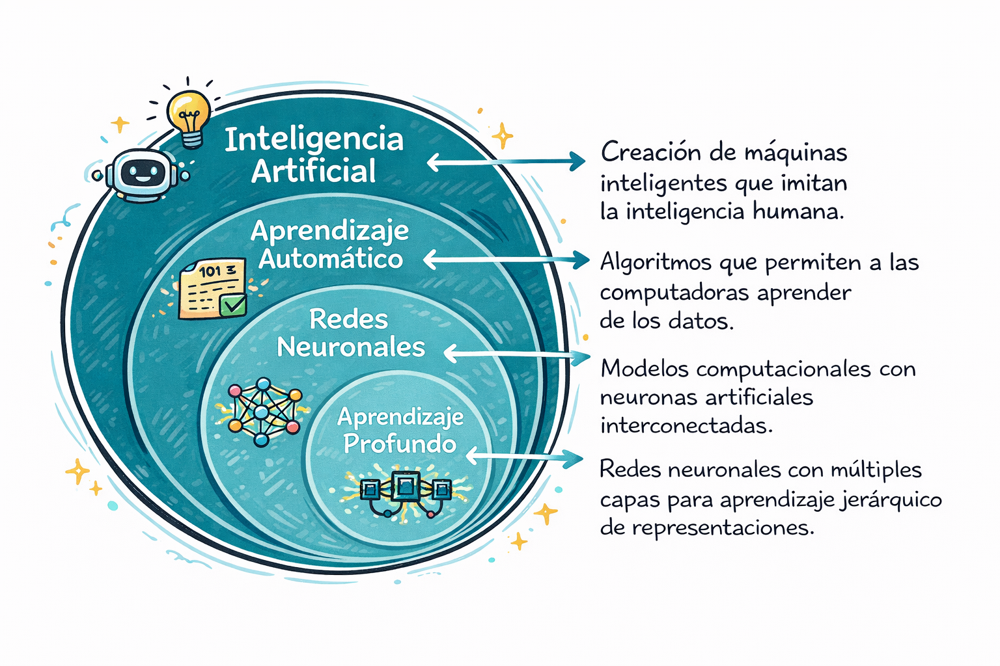
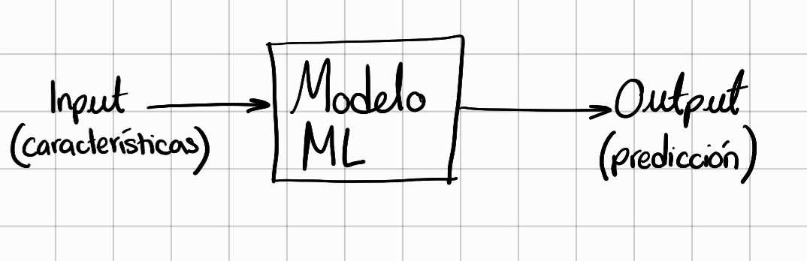
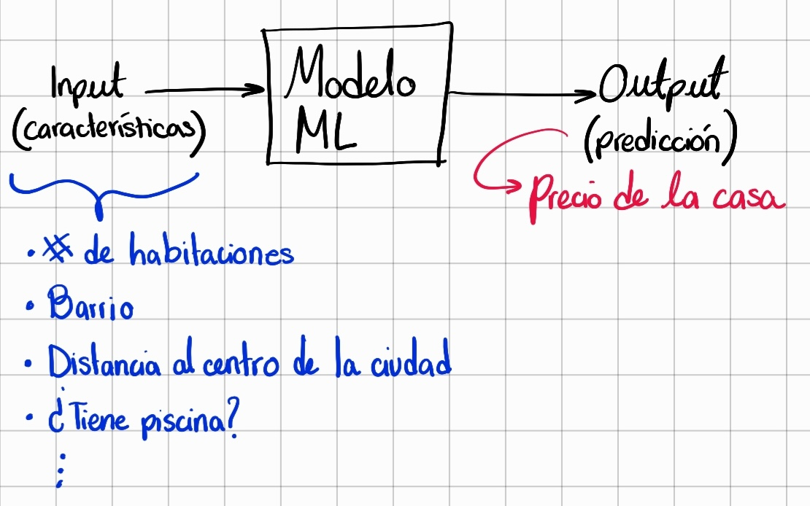
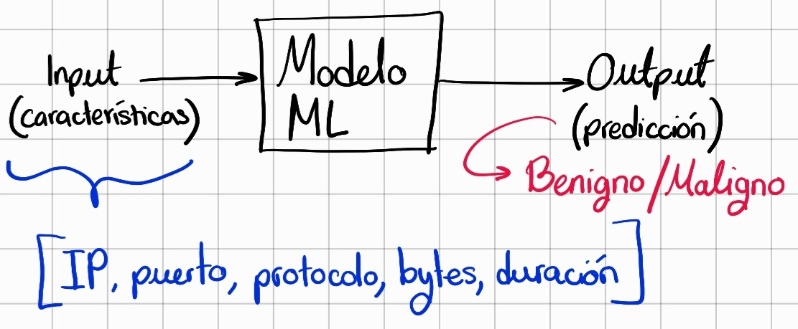
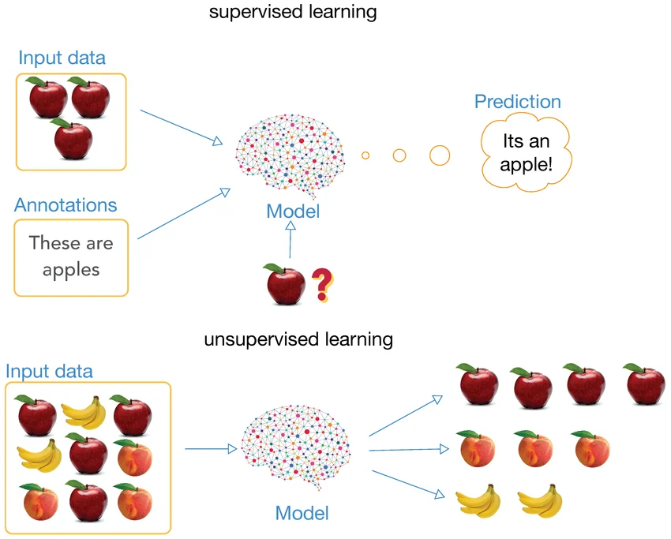
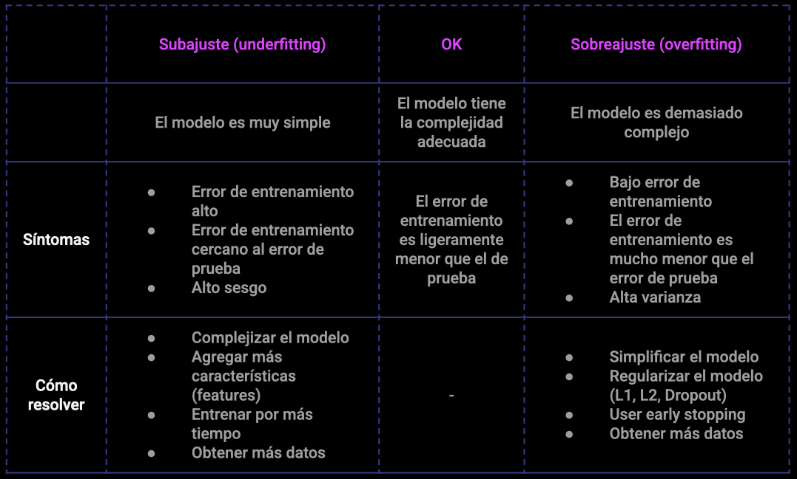
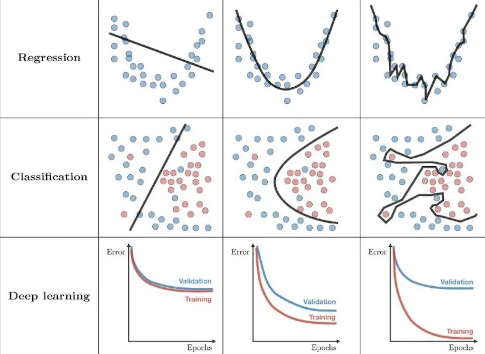

# Cómo Funciona el ML Aplicado a Seguridad


Antes del machine learning, todos los programas de detección tenían que ser programados explícitamente con reglas, línea por línea: "si esto entonces aquello". Para seguridad, eso era problemático por dos razones: 
1. las amenazas son complejas y difíciles de traducir a reglas exhaustivas, y 
2. el comportamiento cambia. En el momento en que se define una regla, el atacante ya encontró una manera de evadirla.


El **Machine Learning (ML)** es una rama de la inteligencia artificial donde los algoritmos **aprenden patrones de datos** en lugar de ser programados explícitamente con reglas. En vez de escribir cada condición, le das ejemplos al algoritmo y él infiere automáticamente qué patrones son relevantes. Ese cambio de paradigma fue transformador: aunque tiene limitaciones concretas que se cubren más adelante en este módulo.

## 1. Conceptos básicos de Machine Learning

### ¿Qué es IA y ML?

La inteligencia artificial es el campo que engloba cualquier programa que intente replicar aspectos de la inteligencia humana. Eso incluye sistemas muy simples basados en reglas (los llamados "sistemas expertos") como un sistema de diagnóstico de enfermedades donde la entrada es una lista de síntomas y la salida es un diagnóstico.


Dentro de la IA, hay un subconjunto de programas capaces de inferir esas reglas aprendiendo de datos: eso es el **machine learning**.



En ML, el objetivo es construir un **modelo** que puede **predecir** algo basándose en datos. Un modelo es esencialmente una función matemática: toma inputs y produce outputs.



Por ejemplo, un modelo puede predecir el precio de una casa. La salida (output) es el precio; la entrada (input) son las características de la casa: cantidad de habitaciones, barrio, distancia al centro, si tiene piscina, si tiene jardín, etc.



El mismo concepto aplica directamente a seguridad: predecir si un evento en el tráfico de red es tráfico normal o un posible ataque.



### ¿Cómo se construye un modelo de ML?


El proceso de crear un modelo tiene fases:

**1. Recolección de datos**
Necesitas muchos ejemplos de lo que quieres detectar. Para detectar malware, necesitas ejemplos de archivos maliciosos confirmados y archivos benignos confirmados.

**2. Extracción de características (features)**
Las características son los números que le das al modelo. Para un archivo, podrían ser: tamaño, número de funciones importadas, entropía, etc. La selección de características es IMPORTANTE: buenas características hacen que el modelo sea efectivo.

**3. Entrenamiento**
El algoritmo ML "aprende" ajustando parámetros internos basándose en los datos. Después del entrenamiento, tienes un modelo que puede hacer predicciones.

**4. Evaluación**
Probamos el modelo en datos nuevos, que nunca vio antes, para estimar su rendimiento en la vida real.

**5. Deployado**
Si el modelo se desempeña bien, lo usas en producción.

## 2. Aprendizaje supervisado vs. no supervisado

### Aprendizaje supervisado

El dataset de entrenamiento contiene ejemplos etiquetados de lo que queremos detectar. El modelo aprende cuáles características tienen más peso para hacer una predicción correcta.

```
Datos de entrenamiento:
[Archivo A] → Malware (etiqueta)
[Archivo B] → Benigno (etiqueta)
[Archivo C] → Malware (etiqueta)
[Archivo D] → Benigno (etiqueta)

El modelo aprende: "¿Cuáles son las características que separan malware de benigno?"
```


Ventajas:
- Si tenés etiquetas correctas, el aprendizaje supervisado es efectivo
- Es directamente aplicable al problema (detectar malware)

Desventajas:
- Requiere datos etiquetados manualmente, que es costoso
- Solo puede detectar lo que fue entrenado a detectar (no detecta nuevas variantes de malware nunca vistas)

### Aprendizaje No Supervisado

No hay etiquetas. El modelo intenta encontrar **patrones** ocultos en los datos: busca similitudes y agrupa los ejemplos. Cuando llega un dato nuevo, el modelo indica a qué grupo (cluster) pertenece según sus características.



```
Datos sin etiquetas:
[Archivo A, B, C, D, E, F, ...]

El modelo agrupa: "Estos archivos se parecen, probablemente pertenecen al mismo cluster"

Resultado:
Cluster 1: [A, C, F] → Podrían ser malware similar
Cluster 2: [B, D, E] → Podrían ser archivos legítimos
```

Ventajas:
- No requiere etiquetado manual
- Puede detectar anomalías o patrones inesperados

Desventajas:
- Más difícil de validar si el resultado es correcto
- Los clusters pueden no corresponder a "malware" vs "benigno"

En seguridad, el aprendizaje supervisado es más común para detección, pero el no supervisado es excelente para **detección de anomalías** (por ejemplo, un usuario en horario normal nunca accedió a este recurso, ahora lo hace a las 3 AM).

### Algoritmos comunes

Los algoritmos de ML supervisados más comunes en seguridad incluyen:

- **Basados en árboles** — aprenden reglas de decisión a partir de los datos
    - **Árbol de Decisión:** Construye un árbol de preguntas binarias. Fácil de entender pero puede sobreajustarse.
    - **Random Forest:** Combina múltiples árboles para reducir el sobreajuste. Más robusto que un árbol individual.
- **Modelos lineales** — encuentran una frontera de decisión matemática entre clases
    - **Regresión Logística:** Modelo simple pero poderoso para clasificación binaria. Fácil de interpretar.
    - **Máquinas de Vectores de Soporte (SVM):** Encuentra el límite óptimo que maximiza la separación entre clases.
- **Redes Neuronales** — aprenden representaciones complejas de los datos
    - **Redes Neuronales (DNN):** Modelos de múltiples capas inspirados en el cerebro. Muy potentes pero requieren grandes volúmenes de datos y tiempo de entrenamiento.

Los algoritmos de ML no supervisados más comunes en seguridad incluyen:

- **Detección de anomalías** — identificar comportamientos que se desvían de lo normal
    - **Isolation Forest:** Aísla comportamientos raros del resto de los datos. Muy usado para detección de anomalías en tráfico de red.
    - **Autoencoders:** Redes neuronales que aprenden a reconstruir comportamiento normal. Lo que no pueden reconstruir bien es una anomalía.
    - **One-Class SVM:** Entrena únicamente con datos normales y rechaza todo lo que no encaja en ese perfil.
- **Clustering** — agrupar comportamientos similares para detectar lo que no encaja
    - **K-Means:** Divide los datos en grupos por similitud. Útil para segmentar tipos de tráfico o agrupar familias de malware.
    - **DBSCAN:** Agrupa comportamientos en clusters de densidad variable. Lo que no pertenece a ningún grupo es considerado sospechoso.
- **Reducción de dimensionalidad** — simplificar los datos antes de analizarlos
    - **PCA (Análisis de Componentes Principales):** Reduce la cantidad de variables manteniendo la información más relevante. Se usa para preprocesar datos antes de aplicar otro modelo.
    - **t-SNE / UMAP:** Comprimen los datos a 2D para visualizar clusters de tráfico o malware de forma comprensible para el analista.
## 3. Métricas

La métrica más intuitiva para evaluar un modelo es el **Accuracy**: el porcentaje de predicciones correctas sobre el total. Si el modelo acertó 90 de 100 casos, su Accuracy es 90%.

El problema es que en seguridad las clases están muy desbalanceadas: el 99% del tráfico es normal y solo el 1% son ataques. Un modelo que responde "normal" para absolutamente todo tiene **99% de Accuracy**, pero nunca detectó ningún ataque. Entonces, necesitamos algo más preciso.

Para evaluar correctamente necesitamos entender los cuatro casos posibles:

|                        | Modelo predijo: Ataque  | Modelo predijo: Normal  |
| :--------------------- | :---------------------: | :---------------------: |
| **Era un ataque real** | TP (Verdadero Positivo) |   FN (Falso Negativo)   |
| **Era tráfico normal** |   FP (Falso Positivo)   | TN (Verdadero Negativo) |

- **TP (Verdadero Positivo)** — detectó un ataque real. Lo que queremos.
- **TN (Verdadero Negativo)** — dejó pasar tráfico legítimo. Correcto.
- **FP (Falso Positivo)** — alarma sobre tráfico legítimo. _Ruido para el analista._
- **FN (Falso Negativo)** — dejó pasar un ataque real. _El peligro que no detectaste._

![[Screenshot 2026-03-19 at 6.42.43 PM.png]]

Precision nos dice: de las alertas que generé, ¿cuántas eran reales?

Recall nos dice: de los ataques reales, ¿cuántos detecté?

**Precision alta, Recall bajo:** el modelo levanta pocas alertas, pero casi todas son reales. El problema es que dejó pasar muchos ataques.

**Recall alto, Precision bajo:** el modelo detecta casi todos los ataques, pero genera mucho ruido. Los analistas se ahogan en falsos positivos.

En seguridad queremos un balance: detectar la mayoría de los ataques sin generar tantas falsas alarmas que el equipo no pueda procesarlas. El **F1 Score** captura ese balance en un solo número: es la métrica principal para evaluar modelos de detección.

```
F1 Score   = 2 × (Precision × Recall) / (Precision + Recall)
```

Un ejemplo concreto: un modelo con Precision = 1.0 y Recall = 0.0 tiene F1 = 0, aunque su Accuracy parezca aceptable. El F1 expone ese tipo de modelos inútiles que la Accuracy esconde.

## 4. Entrenamiento, validación y overfitting

Un error común es entrenar un modelo y luego evaluarlo en los **mismos datos** que fue entrenado. Esto da una ilusión de rendimiento. 

El problema es **overfitting**: el modelo memoriza los datos de entrenamiento en lugar de aprender patrones generalizables. Es como aprender a pasar un examen memorizando todas las preguntas anteriores: funciona en el examen anterior pero fracasa en preguntas nuevas.

La **validación cruzada** divide los datos en 5 partes. El modelo se entrena en 4 partes y se valida en 1. Se repite 5 veces, usando diferentes partes para validación. Esto te da una visión más honesta del rendimiento real:

```python
from sklearn.model_selection import cross_val_score

modelo = RandomForestClassifier()
scores = cross_val_score(modelo, X, y, cv=5)  # 5-fold cross validation

print(f"Scores de cada fold: {scores}")
print(f"Promedio: {scores.mean():.2f}, Std: {scores.std():.2f}")
```

Con validación cruzada, ves los scores de cada iteración: si algunos son mucho más bajos que otros, significa que el modelo es inconsistente. Si todos son relativamente bajos, el modelo simplemente no es lo suficientemente bueno. Si están todos cerca del promedio, tenés un modelo confiable.

### Overfitting vs. Underfitting:





Un modelo simple (underfitting) tiene alto error en ambos entrenamiento y test. 
Un modelo muy complejo (overfitting) tiene bajo error en entrenamiento pero alto error en test. 
El punto que queremos es un modelo lo suficientemente complejo para capturar patrones, pero no tanto como para memorizar.

## 5. Ajuste y calibración continua del modelo

Un modelo no debe ser estático. Debe ajustarse continuamente basándose en datos reales:

#### Feedback de Analistas

Los analistas investigarán casos HIGH y CRITICAL. Registra su veredicto:

```
Caso #123:
  Predicción: Score 85 (CRITICAL)
  Veredicto analista: Falso positivo (fue error de configuración)
  → Modelo fue incorrecto, agregar caso en el dataset para re-entrenar

Caso #456:
  Predicción: Score 25 (LOW)
  Veredicto analista: Verdadero ataque (después de investigación)
  → Modelo falló, agregar caso en el dataset para re-entrenar
```

#### Re-entrenamiento Periódico

Periódicamente (mensualmente o trimestralmente), reunís nuevos datos que fueron etiquetados por analistas y reentrenás el modelo. Esto asegura que el modelo se adapte a nuevas amenazas y características de tu entorno específico. Acá te muestro el pipeline básico:

```python
# Recolectar datos nuevos de los últimos 3 meses
eventos_recientes = obtener_eventos_desde(hace_90_dias())

# Etiquetar verdaderos positivos/negativos basándose en veredictos
X_nuevo = [evento['features'] for evento in eventos_recientes]
y_nuevo = [evento['veredicto_final'] for evento in eventos_recientes]

# Reentrenar modelo
modelo_ml.fit(X_nuevo, y_nuevo)

# Validar que no empeoró
if nuevo_accuracy > anterior_accuracy:
    desplegar_nuevo_modelo()
else:
    mantener_modelo_anterior()
```

Este ciclo es el corazón de un programa de ML en producción: recopilás feedback, reeentrenás, validás que mejora (no empeora), y deployás solo si es seguro.

## 5. Limitaciones del ML en entornos de seguridad

ML es poderoso, pero tiene limitaciones significativas:

**1. Requiere datos históricos abundantes**

Un modelo necesita cientos o miles de ejemplos para entrenar. En seguridad, a menudo tienes pocos ejemplos de nuevas amenazas. Esto se llama el **"cold start problem"**: no puedes entrenar un modelo para detectar un tipo de malware completamente nuevo si nunca has visto ejemplos antes.

**2. Es vulnerable a ataques adversariales**

Un atacante inteligente puede manipular sus acciones para evadir el modelo. Si sabe que el modelo detecta "más de 100 imports de DLL", simplemente puede escribir malware con exactamente 99 imports. El malware puede "camuflarse" para parecerse a software legítimo.

**3. Garbage in, garbage out**

Si los datos de entrenamiento son incorrectos o sesgados, el modelo será incorrecto o sesgado. Si la mayoría de tus datos de entrenamiento son usuarios Europeos, el modelo puede tener sesgos para detectar mal comportamiento de usuarios Asiáticos.

**4. Falta de explicabilidad**

Las redes neuronales profundas ("deep learning") son "cajas negras": dicen "esto es malware" pero no puedes entender por qué. Esto es un problema en seguridad porque los analistas necesitan entender el razonamiento para confiar en las predicciones. Los "Árboles de Decisión" son más explicables: puedes ver exactamente qué preguntas hizo el modelo.

**5. Cambio de distribución**

Si la distribución de datos cambia, el modelo falla. Por ejemplo, entrenar un modelo en malware de 2020, pero usarlo en 2024 cuando el malware ha evolucionado. Esto es llamado "concept drift".

**6. Alto costo de falsos positivos**

En automatización de seguridad, un falso positivo puede ser desastroso. Un modelo que bloquea el 99% de malware pero tiene 1% falsos positivos podría bloquear cientos de aplicaciones legítimas al día si procesa millones de archivos. Los analistas se ven abrumados.

Por estas razones, los mejores enfoques combinan ML con lógica basada en reglas y revisión humana:

- Usa ML para hacer predicciones iniciales
- Usa reglas para aplicar conocimiento de expertos
- Usa "human-in-the-loop" para revisar predicciones de confianza baja
- Monitorea continuamente para detectar cambios en distribución de datos

