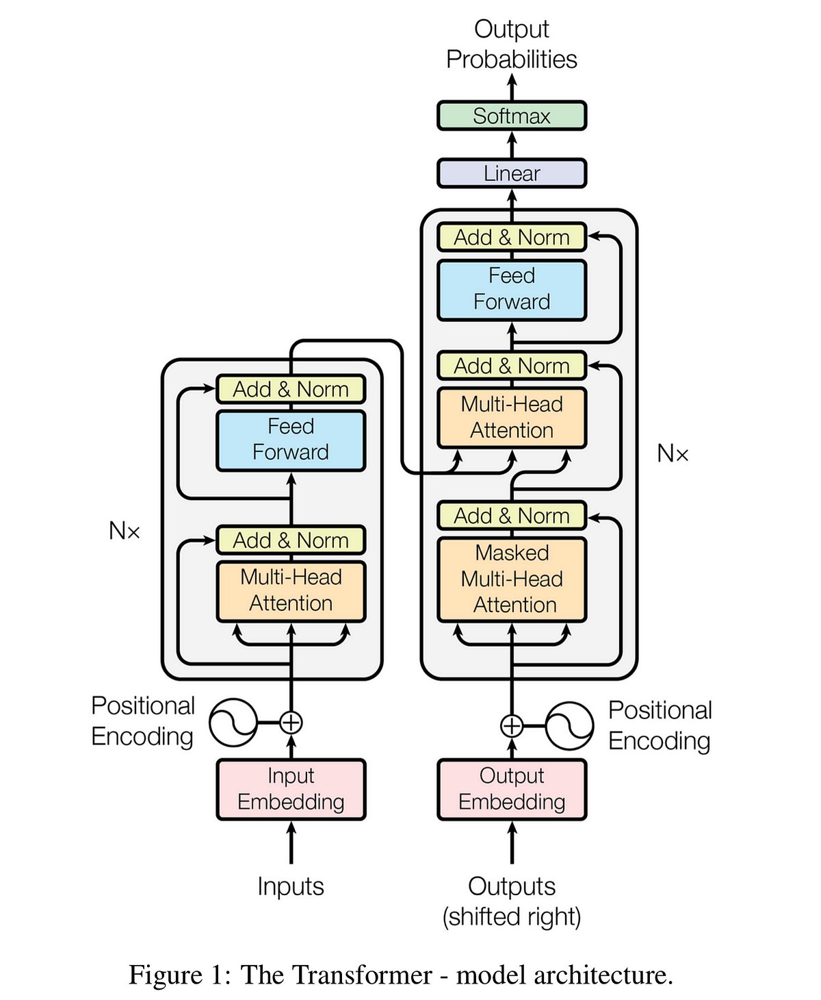
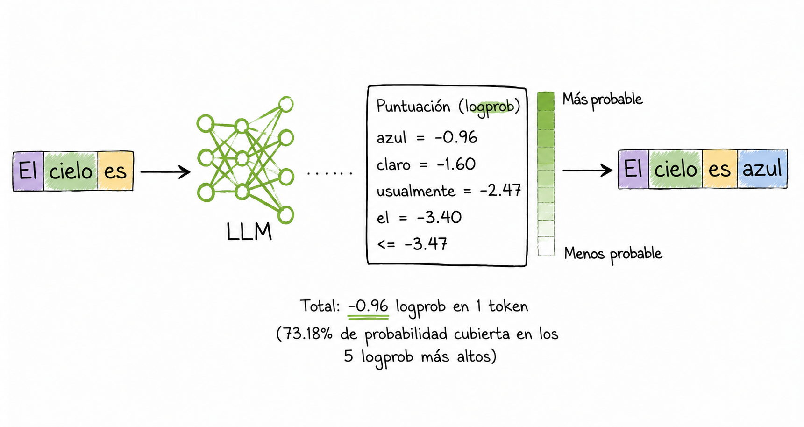

# LLMs en el SOC: Cómo Funcionan y Qué Implica Eso

Antes de usar LLMs en producción, necesitás entender qué son realmente. Porque si entendés cómo funciona la predicción de tokens, vas a entender automáticamente por qué alucinan, cuándo confiar en ellos y cuándo no, qué tipo de preguntas tienen sentido hacerles, y por qué nunca deberías poner datos sensibles de tu organización en un modelo de OpenAI. Todo lo demás se deriva de ese entendimiento.

---
## 1. Introducción a LLMs: Componentes principales

Un modelo de lenguaje de gran tamaño consta de los siguientes elementos. En primer lugar, necesitás muchísimos datos. Esto incluye datos obtenidos al rastrear internet con algoritmos especializados llamados “crawlers”, que recolectan toda esta información: toneladas y toneladas de páginas web y una enorme cantidad de datos, todo lo que puedan recopilar de internet. Incluye cosas como toda Wikipedia, muchos libros distintos y el texto contenido en ellos, y muchísimo más. Estamos hablando de cantidades gigantescas de datos.


Además, necesitás una arquitectura de tipo transformer. Vamos a hablar un poco más de esto más adelante, pero es un componente fundamental de un modelo de lenguaje de gran tamaño.



Luego, necesitás realizar el preentrenamiento. Esto es cuando tomás la arquitectura del modelo y la entrenás con los datos que recopilaste. Específicamente, lo entrenás para predecir la siguiente palabra. Le das muchas oraciones diferentes y le pedís que prediga cuál es la próxima palabra, y después verificás si acertó. Con eso ajustás el modelo, ayudándolo a aprender cada vez más para mejorar en esa tarea.

Todo esto se hace en GPUs, y necesitás muchas para hacerlo en paralelo y que sea más rápido. También necesitás mucho dinero: estamos hablando de decenas o incluso cientos de millones de dólares para entrenar un modelo de este tipo. Y además lleva mucho tiempo: semanas e incluso meses de entrenamiento.


Y una vez que el modelo está pre-entrenado, podés aplicar cosas como el aprendizaje por refuerzo a partir de feedback humano para ayudarlo a entender mejor qué respuestas esperan realmente las personas. Básicamente, hay humanos que revisan las respuestas que el modelo genera y le muestran ejemplos de cómo debería responder.


Y por último, también podés hacer un ajuste fino (fine-tuning) con datos específicos de un dominio según tu caso de uso. Esta es la parte que resulta más interesante para las empresas. Ya sea que tengas datos médicos, financieros, de cine, legales o incluso una base de conocimiento interna donde tus empleados suelen buscar respuestas sobre cómo hacer ciertas cosas dentro de la empresa, podés ajustar un modelo de lenguaje con cualquiera de esos conjuntos de datos.

De esta forma, tanto tus empleados como tus clientes pueden obtener mejores respuestas sin tener que buscarlas manualmente, sino directamente a través del modelo de lenguaje.

Esos son los componentes principales de los LLMs.

## 2. Como se inventaron

Todo empezó cuando un equipo de ocho investigadores de Google publicó en 2017 el paper titulado Attention Is All You Need. Ahí fue cuando introdujeron por primera vez la arquitectura de IA conocida como Transformer. Es un trabajo revolucionario, citado más de cien mil veces, lo cual es una barbaridad para un paper académico.

La arquitectura Transformer se ve más o menos así. No vamos a entrar en demasiado detalle porque es un tema bastante técnico, pero quedate con la idea de que tiene dos partes: un _encoder_ y un _decoder_. Originalmente se diseñó para tareas de traducción automática, es decir, pasar de un idioma a otro.

Después, algunos investigadores de OpenAI descubrieron algo interesante: si tomás esta arquitectura y eliminás el encoder, te queda un modelo basado solo en el decoder. Y resulta que esa versión es especialmente buena generando texto.

Y justamente esa es la arquitectura que usan los modelos de lenguaje más potentes hoy en día, como ChatGPT, LLaMA y Claude.

## 3. Cómo funciona un LLM: predicción de la siguiente palabra

Bien, entonces tenemos un modelo de lenguaje de gran tamaño y le damos un _prompt_: “¿Cuál es la capital de Francia?”. Todo ese texto entra como entrada al modelo. El modelo hace sus operaciones matemáticas y como salida produce **una sola palabra**, la siguiente más probable.


¿Cómo sabe cuál es la palabra más probable? Porque ha visto enormes cantidades de texto: internet, libros, Wikipedia, y mucho más. Entonces aprendió patrones sobre cómo las palabras suelen seguirse entre sí. Aunque no “recuerde” exactamente esa frase, sí sabe predecir qué suele venir después basándose en todo lo que vio.

En este caso, la palabra más probable podría ser “la”. Y esto es clave: **solo genera una palabra a la vez**.


Después, toma todo el input original más esa palabra generada (“la”) y lo vuelve a meter como entrada al modelo. Otra vez hace los cálculos y genera la siguiente palabra más probable. Ahora podría ser “capital”. De nuevo, solo una palabra.


Luego repite el proceso: toma todo lo que tiene hasta ahora (“la capital”), lo usa como entrada y predice la siguiente palabra, por ejemplo “de”.

Y así sigue, palabra por palabra, como si estuviera armando la frase paso a paso, hasta que en algún momento predice algo especial: el _token de fin de secuencia_.


Ese token indica que, según sus predicciones, la frase ya debería terminar. No lo vemos como usuarios, queda “detrás de escena”. Es simplemente una señal interna para que el modelo deje de generar texto.

En este ejemplo, el resultado final sería algo como: “La capital de Francia es París.”.

La idea clave es esta: los modelos de lenguaje están diseñados para **predecir la siguiente palabra más probable**, una y otra vez, usando tanto el texto original como lo que ya generaron, en un proceso iterativo, hasta que deciden que la secuencia terminó.

Un LLM es, en su núcleo, un predictor de tokens. Un **token** es la unidad mínima de texto que procesa el modelo: aproximadamente una sílaba o palabra corta. El modelo fue entrenado en una cantidad enorme de texto (internet, libros, código) con un objetivo simple: dado un contexto de texto, predecir cuál es el siguiente token más probable.

El proceso de generar una respuesta es siempre el mismo:

```
Contexto: "El proceso explorer.exe fue lanzado desde"
Token 1: "una" (85% probabilidad) → seleccionado
Token 2: "ubicación" (72% probabilidad) → seleccionado
Token 3: "sospechosa" (68% probabilidad) → seleccionado
...
```

Esto continúa token a token hasta completar la respuesta. El modelo no "piensa" la respuesta completa y después la escribe: la construye incrementalmente, y cada token elegido afecta la probabilidad de los siguientes.

---

## 4. Por qué alucinan — y por qué es inevitable

Una vez que entendés que el modelo predice tokens por probabilidad, la alucinación deja de ser un algo misterioso y se convierte en una consecuencia directa del mecanismo.

El modelo no sabe si una afirmación es verdadera. Sabe qué token es estadísticamente probable dado el contexto. Si en su entrenamiento vio muchas veces "el malware X se conecta a dominios .ru", va a tender a generar esa afirmación con alta confianza, incluso si el malware específico que le estás preguntando no tiene ese comportamiento. El modelo está completando un patrón, no verificando un hecho.



**Tres problemas concretos para el SOC:**

**IOCs fabricados.** El modelo puede generarte una IP, un hash, un dominio que parece completamente real: tiene el formato correcto, es estadísticamente plausible pero no existe en ningún reporte ni base de datos. Un analista que copia esos IOCs a un sistema de threat intelligence está contaminando su base de conocimiento. No los podés usar para reglas del SIEM.

**Puntos ciegos.** El modelo tiene una fecha de corte de entrenamiento. Si le preguntás por una amenaza que ocurrió después de esa fecha, no te va a decir "no sé", te va a inventar una respuesta que suena convincente. Especialmente crítico con amenazas nuevas o campañas recientes.

**Mucha confianza.** El modelo no te dice "estoy dudando". Te responde con un tono seguro aunque esté equivocado. Una respuesta que suena como de un senior experto puede ser totalmente incorrecta. No hay señal en el estilo de escritura que te indique cuándo está alucinando.

La mitigación no es escribir prompts más específicos: eso no resuelve el problema de fondo. La mitigación es **nunca confiar en afirmaciones del LLM sin verificarlas contra fuentes reales**: tu SIEM, VirusTotal, tu CMDB.

---

## 5. Implicaciones operacionales: qué no poner en un LLM externo

Hoy tenemos la opción de correr modelos **localmente**, en servidores propios. LLaMA, Mistral, Qwen son modelos open source que pueden correr en tu propia infraestructura. No son tan capaces como los últimos de OpenAI o Anthropic, pero el contexto del incidente nunca sale de tu red y el problema de privacidad de datos desaparece.

Si en cambio estás usando una API externa (OpenAI, Anthropic, Gemini) hay cosas que no deberían pasar nunca. Cuando enviás texto a una API externa, ese texto viaja a servidores de terceros y puede quedar en logs, usarse para entrenamiento futuro, o estar sujeto a jurisdicciones legales distintas.

**Lo que nunca deberías enviar a un modelo externo:**

- Indicadores de compromiso activos de un incidente en curso (IPs, dominios, hashes de una brecha que todavía no fue divulgada)
- Logs con datos de usuarios internos (nombres, emails, actividad de empleados)
- Configuraciones de red, topología de infraestructura, rangos IP internos
- Código propietario de sistemas internos
- Datos de clientes o pacientes (PII, PHI)
- Cualquier información cubierta por NDA o regulaciones como GDPR o HIPAA

---

## 6. Cómo acceder a LLMs desde Python

El acceso es siempre a través de API. El patrón es simple: autenticación con API key, construcción del mensaje (prompt), llamada HTTP, parseo de respuesta.

```python
import anthropic

client = anthropic.Anthropic(api_key="tu_api_key")  # nunca hardcodeada — usá .env

response = client.messages.create(
    model="claude-sonnet-4-6",   # modelo actual de Anthropic
    max_tokens=1024,
    temperature=0.2,  # bajo para consistencia
    messages=[
        {"role": "user", "content": "Analiza esta alerta de seguridad: ..."}
    ]
)

print(response.content[0].text)

```

---

## 7. Aplicaciones concretas en el SOC

Con el mecanismo entendido, las aplicaciones tienen sentido. Los LLMs son buenos en tareas donde el texto tiene patrones reconocibles y donde una respuesta aproximada es útil aunque no perfecta y siempre con verificación posterior.

**Triaje de alertas:**

```python
def triaje_con_llm(alerta_raw):
    """Usa LLM para triaje de alerta: resultado siempre verificar contra datos reales"""

    prompt = f"""
    You are a SOC analyst triaging security alerts.
    Analyze this alert and provide:
    1. Severity: CRITICAL/HIGH/MEDIUM/LOW
    2. False positive likely: YES/NO/UNCERTAIN
    3. Recommended action: INVESTIGATE_NOW/ESCALATE/MONITOR/CLOSE
    4. Reasoning: explain your assessment in 2-3 sentences

    Alert data:
    {json.dumps(alerta_raw, indent=2)}
    """

    response = client.messages.create(
        model="claude-haiku-4-5-20251001",  # haiku: respuestas cortas y alta frecuencia
        max_tokens=400,
        temperature=0.1,
        messages=[{"role": "user", "content": prompt}]
    )

    return response.content[0].text
    
    
```

**Clasificación de tipo de evento:**

```python
def clasificar_evento_llm(evento_texto):
    """Clasifica tipo de evento — útil para routing automático de alertas"""

    prompt = f"""
    Classify this security event into EXACTLY ONE category:
    MALWARE_EXECUTION | DATA_EXFILTRATION | PRIVILEGE_ESCALATION |
    LATERAL_MOVEMENT | CREDENTIAL_COMPROMISE | PHISHING |
    POLICY_VIOLATION | SYSTEM_ERROR | LEGITIMATE_ACTIVITY

    Event: {evento_texto}
    """

    response = client.messages.create(
        model="claude-haiku-4-5-20251001",  # haiku: clasificación corta y determinística
        max_tokens=50,
        temperature=0.0,  # clasificación: queremos determinismo
        messages=[{"role": "user", "content": prompt}]
    )

    return response.content[0].text
```

Importante: esto no reemplaza al analista. El analista igual tiene que revisar. Pero si tienen 500 alertas y pueden pre-clasificarlas automáticamente con algo de información ya masticada, mejor.

**Deobfuscación de código malicioso:**

El malware viene ofuscado intencionalmente: variables sin nombre, strings en base64, funciones anidadas. Si le pasás ese fragmento a un LLM y le pedís que lo analice, puede reconocer patrones y darte una idea general de qué está haciendo. Sirve para decidir si vale la pena mandarlo a un sandbox o descartarlo. Pero hay limitaciones: para malware muy sofisticado el LLM puede equivocarse, y nunca puede ejecutar el código, solo lee texto estático. Sirve como primer filtro, no como veredicto final. La clase de análisis de malware entra en detalle.

**Resumen de reportes de threat intelligence:**

Un reporte de threat intel puede tener 50, 80, 100 páginas. Un LLM puede resumirlo en una sola página: familia del malware, vector de ataque, sistemas afectados, IOCs, acciones recomendadas. Y si le pedís la salida en JSON estructurado con un schema definido, podés parsearla programáticamente y meterla directo en una lista de bloqueo o regla de detección. Algo que antes hacía un analista en dos horas ahora toma segundos, pero siempre verificando los IOCs contra VirusTotal antes de usarlos.

**Generación de reportes de incidentes:**

Los reportes de incidente tienen siempre la misma estructura: executive summary, timeline, análisis técnico, impact assessment, root cause, recomendaciones. Si la estructura es siempre la misma y vos ya recolectaste toda la información durante la investigación, el LLM puede redactar el reporte. Lo que tomaría 2-3 horas de redacción ahora toma minutos. La clase de generación de reportes muestra cómo personalizar el template según el tipo de incidente (phishing, malware, exfiltración) y cómo hacer verificaciones automáticas antes de publicarlo.

---

## 8. Escribir prompts como consecuencia de entender el modelo

El "prompt engineering" como disciplina separada está sobredimensionado. Si entendés cómo funciona el modelo, las técnicas para escribir buenos prompts se derivan solas:

**Definir el formato de salida explícitamente.** El modelo predice tokens; si no le decís qué formato querés, va a generar lo que estadísticamente más aparece después de ese tipo de pregunta. Si le decís "responde SOLO con: CATEGORÍA: confianza%", vas a obtener exactamente eso.

**Dar ejemplos cuando necesitás consistencia (few-shot).** En lugar de describir con palabras qué querés, mostrar 2-3 ejemplos es más efectivo porque el modelo reconoce el patrón directamente:

```
Alert: 'Failed password for user admin' → Attack
Alert: 'Database connection timeout' → Error
Alert: 'User logged in from home office' → Normal

Now classify: [nueva alerta]
```

**Pedir razonamiento explícito para reducir alucinaciones (chain-of-thought).** Cuando le pedís al modelo que razone paso a paso antes de concluir, es estadísticamente menos probable que alucine, porque tiene que generar tokens que justifiquen cada afirmación. También te permite ver en qué paso se equivocó.

**Verificar afirmaciones factuales siempre.** No como técnica de prompting sino como regla operacional: cualquier cosa que el modelo afirme sobre el mundo real (este IP es malicioso, este hash pertenece a X familia, este usuario tiene el rol Y) tiene que verificarse contra fuentes reales antes de actuar.

Eso es todo lo que necesitás sobre prompts. Las siguientes clases cubren las aplicaciones específicas: análisis de malware, generación de reportes, y en la clase de MCP, asistentes integrados con herramientas.
