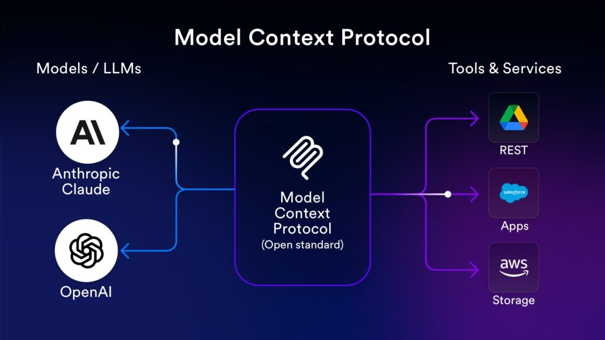

# Model Context Protocol (MCP) en Entornos de Seguridad

Durante años, los LLMs sabían muchísimo, pero no podían *hacer* nada. Podías preguntarle a un modelo qué hace un hash de malware, pero no podía consultarlo en VirusTotal, buscar en tu SIEM, ni aislar un endpoint en tu EDR. Solo podía responderte desde su conocimiento estático.

El **Model Context Protocol (MCP)** es un protocolo abierto que define *cómo* un LLM se conecta a herramientas, datos y sistemas externos de forma estandarizada. En términos prácticos: con MCP podés construir un asistente de seguridad que tiene acceso real a tu stack del SOC, en tiempo real, con datos reales.

---

## 1. ¿Qué es MCP y por qué debería importarte?

### El problema que resuelve: el caos de N×M integraciones

Antes de MCP, conectar un LLM a una herramienta de seguridad era un dolor de cabeza. Cada vendor inventaba su propia forma de hacerlo. Si querías que GPT-4 hablara con Splunk, necesitabas una integración custom. Si querías que Claude hablara con CrowdStrike, otra integración. Si mañana Anthropic cambiaba cómo funciona su API, tenías que reescribir todo.

El resultado era este problema matemático horrible:

```
N herramientas × M modelos = N×M integraciones custom para mantener
```

Con 5 herramientas y 3 modelos: **15 integraciones distintas**. Pesadilla.

**MCP lo convierte en N+M:** cada herramienta escribe un servidor MCP una vez, y cualquier modelo compatible con MCP puede usarla inmediatamente.

### La arquitectura: cliente-servidor



MCP define un protocolo estándar donde el LLM actúa como cliente y cada herramienta expone un servidor.

Cada servidor MCP expone tres tipos de cosas:

- **Tools**: funciones que el LLM *puede ejecutar* (ej: `consultar_virustotal(hash)`). El LLM decide cuándo llamarlas.
- **Resources**: datos que el LLM *puede leer* (ej: tus playbooks, logs, documentos de procedimientos). Es su base de conocimiento.
- **Prompts**: plantillas reutilizables (ej: plantilla de reporte de incidente). Instrucciones pre-armadas.

### El flujo completo: de pregunta natural a API call

Cuando el analista escribe "¿Es malicioso el hash `abc123`?", esto es lo que pasa por atrás:

```
1. Analista escribe: "¿Es malicioso el hash abc123?"

2. LLM razona internamente:
   "El usuario quiere saber si un hash es malicioso.
    Tengo una herramienta llamada 'vt_check_hash' disponible.
    Voy a usarla."

3. LLM → MCP Server:
   { "method": "tools/call",
     "params": { "name": "vt_check_hash",
                 "arguments": { "hash": "abc123" } }}

4. MCP Server hace la API call real a VirusTotal

5. VirusTotal responde con los datos del hash

6. MCP Server devuelve los datos al LLM

7. LLM los interpreta y le responde al analista en lenguaje natural
```

El analista no escribe queries, no toca APIs, no maneja JSON. Solo habla con lenguaje natural. El LLM decide qué herramientas usar, las ejecuta, y sintetiza una respuesta.

---
## 2. Construir tu primer MCP Server de seguridad en Python

### Instalación

```bash
pip install mcp
```

### MCP Server para VirusTotal

Vamos con el ejemplo concreto. La idea: el analista pregunta sobre un hash en lenguaje natural, y el LLM automáticamente consulta la API de VirusTotal, parsea los resultados, y le da una respuesta clara.

```python
# servidor_virustotal.py
import asyncio
import requests
from mcp.server import Server
from mcp.server.stdio import stdio_server
from mcp import types

# Inicializar el servidor MCP con un nombre descriptivo
app = Server("virustotal-soc")
VT_API_KEY = "tu_api_key_aqui"

# ─── Paso 1: Declarar qué herramientas existen ───────────────────────────────
# Esto es lo que el LLM "lee" para saber qué puede hacer.
# Las descripciones importan: el LLM las usa para decidir cuándo llamar cada tool.
@app.list_tools()
async def listar_herramientas():
    return [
        types.Tool(
            name="vt_check_hash",
            description="Consulta VirusTotal para determinar si un hash de archivo es malicioso. "
                        "Retorna cantidad de detecciones, nombre del malware si existe, y veredicto.",
            inputSchema={
                "type": "object",
                "properties": {
                    "hash": {
                        "type": "string",
                        "description": "Hash MD5, SHA1 o SHA256 del archivo a verificar"
                    }
                },
                "required": ["hash"]
            }
        ),
        types.Tool(
            name="vt_check_ip",
            description="Verifica la reputación de una IP en VirusTotal. "
                        "Retorna país, ASN, cantidad de detecciones y veredicto.",
            inputSchema={
                "type": "object",
                "properties": {
                    "ip": {
                        "type": "string",
                        "description": "Dirección IP a verificar"
                    }
                },
                "required": ["ip"]
            }
        ),
        types.Tool(
            name="vt_check_domain",
            description="Verifica la reputación de un dominio en VirusTotal.",
            inputSchema={
                "type": "object",
                "properties": {
                    "domain": {
                        "type": "string",
                        "description": "Dominio a verificar (ej: evil-site.com)"
                    }
                },
                "required": ["domain"]
            }
        )
    ]

# ─── Paso 2: Implementar qué hace cada herramienta cuando la llaman ──────────
@app.call_tool()
async def ejecutar_herramienta(nombre: str, argumentos: dict):
    headers = {"x-apikey": VT_API_KEY}

    if nombre == "vt_check_hash":
        hash_valor = argumentos["hash"]
        response = requests.get(
            f"https://www.virustotal.com/api/v3/files/{hash_valor}",
            headers=headers
        )
        if response.status_code == 404:
            return [types.TextContent(
                type="text",
                text=f"Hash {hash_valor} no encontrado en VirusTotal. Podría ser un archivo nuevo o muy raro."
            )]

        data = response.json()["data"]["attributes"]
        stats = data["last_analysis_stats"]
        total = stats["malicious"] + stats["undetected"] + stats.get("harmless", 0)
        veredicto = "⚠️ MALICIOSO" if stats["malicious"] > 0 else "✅ LIMPIO"

        resultado = (
            f"**Hash:** {hash_valor}\n"
            f"**Veredicto:** {veredicto}\n"
            f"**Detecciones:** {stats['malicious']}/{total}\n"
            f"**Nombre:** {data.get('meaningful_name', 'desconocido')}\n"
            f"**Tipo:** {data.get('type_description', 'desconocido')}"
        )
        return [types.TextContent(type="text", text=resultado)]

    elif nombre == "vt_check_ip":
        ip = argumentos["ip"]
        response = requests.get(
            f"https://www.virustotal.com/api/v3/ip_addresses/{ip}",
            headers=headers
        )
        data = response.json()["data"]["attributes"]
        stats = data["last_analysis_stats"]
        # Umbrales: >5 detecciones = maliciosa, >0 = sospechosa, 0 = limpia
        veredicto = "⚠️ MALICIOSA" if stats["malicious"] > 5 else "🟡 SOSPECHOSA" if stats["malicious"] > 0 else "✅ LIMPIA"
        resultado = (
            f"**IP:** {ip}\n"
            f"**Veredicto:** {veredicto}\n"
            f"**País:** {data.get('country', 'desconocido')}\n"
            f"**ASN:** {data.get('as_owner', 'desconocido')}\n"
            f"**Detecciones:** {stats['malicious']}"
        )
        return [types.TextContent(type="text", text=resultado)]

    elif nombre == "vt_check_domain":
        dominio = argumentos["domain"]
        response = requests.get(
            f"https://www.virustotal.com/api/v3/domains/{dominio}",
            headers=headers
        )
        data = response.json()["data"]["attributes"]
        stats = data["last_analysis_stats"]
        resultado = (
            f"**Dominio:** {dominio}\n"
            f"**Detecciones:** {stats['malicious']}\n"
            f"**Registrar:** {data.get('registrar', 'desconocido')}\n"
            f"**Creado:** {data.get('creation_date', 'desconocido')}"
        )
        return [types.TextContent(type="text", text=resultado)]

    return [types.TextContent(type="text", text=f"Herramienta desconocida: {nombre}")]

# ─── Paso 3: Arrancar el servidor ────────────────────────────────────────────
async def main():
    async with stdio_server() as (read_stream, write_stream):
        await app.run(read_stream, write_stream, app.create_initialization_options())

if __name__ == "__main__":
    asyncio.run(main())
```

**La estructura es siempre la misma en cualquier MCP server:**
1. `list_tools()`: declarás qué herramientas existen y cómo se usan (esto lo lee el LLM)
2. `call_tool()`: implementás qué hace cada una cuando el LLM la ejecuta
3. El servidor corre y espera llamadas

### Conectar el servidor a Claude Desktop

Una vez escrito el servidor, se registra editando `claude_desktop_config.json`:

```json
{
  "mcpServers": {
    "virustotal-soc": {
      "command": "python",
      "args": ["/ruta/a/servidor_virustotal.py"],
      "env": {
        "VT_API_KEY": "tu_api_key"
      }
    }
  }
}
```

Reiniciás Claude Desktop y listo. A partir de ahí, el analista puede preguntarle en lenguaje natural y Claude consultará VirusTotal automáticamente cuando sea necesario, sin que el analista tenga que saber que está pasando por una API.

---

## 3. El asistente SOC completo: múltiples servidores al mismo tiempo

Hasta acá vimos servidores individuales. El poder real aparece cuando los combinás.

Claude Desktop puede conectarse a **varios servidores MCP simultáneamente**. El LLM los ve todos como un conjunto de herramientas disponibles y decide cuáles usar según la situación:

```json
{
  "mcpServers": {
    "virustotal": {
      "command": "python",
      "args": ["/opt/soc-mcp/servidor_virustotal.py"]
    },
    "splunk": {
      "command": "python",
      "args": ["/opt/soc-mcp/servidor_splunk.py"]
    },
    "crowdstrike": {
      "command": "python",
      "args": ["/opt/soc-mcp/servidor_crowdstrike.py"]
    },
    "theHive": {
      "command": "python",
      "args": ["/opt/soc-mcp/servidor_thehive.py"]
    }
  }
}
```

Con esta configuración, el LLM se convierte en un **orquestador**. No solo responde preguntas, coordina múltiples sistemas en paralelo para construir una respuesta completa.

---

## 4. Resources: darle memoria de tu organización al LLM

Las **Tools** son para ejecutar acciones. Los **Resources** son para darle al LLM conocimiento estático (documentos, listas, configuraciones) que puede leer cuando necesita responder algo específico de tu organización.

Un ejemplo: imaginate que construís un asistente para una librería. Si alguien pregunta "¿tienen el último libro de Borges?", el LLM solo puede responder correctamente si tiene acceso al catálogo de la librería. Ese catálogo es un Resource. El LLM no lo tiene en su entrenamiento, pero podés exponérselo:

```python
@app.list_resources()
async def listar_recursos():
    return [
        types.Resource(
            uri="libreria://catalogo",
            name="Catálogo de libros disponibles",
            description="Lista actualizada de libros en stock con autor, precio y disponibilidad",
            mimeType="application/json"
        )
    ]

@app.read_resource()
async def leer_recurso(uri: str):
    if uri == "libreria://catalogo":
        catalogo = [
            {"titulo": "Ficciones", "autor": "Borges", "stock": 3},
            {"titulo": "El Aleph", "autor": "Borges", "stock": 0},
        ]
        return types.ReadResourceResult(
            contents=[types.TextResourceContents(
                uri=uri, mimeType="application/json", text=json.dumps(catalogo)
            )]
        )
```

El LLM lee ese recurso y ya puede responder: "Tienen Ficciones (3 en stock) pero El Aleph está agotado."

En el SOC es exactamente lo mismo, pero los recursos son tus playbooks y tu inventario de activos:

```python
@app.list_resources()
async def listar_recursos():
    return [
        types.Resource(
            uri="soc://playbooks/phishing",
            name="Playbook de respuesta a phishing",
            description="Procedimiento paso a paso para responder a incidentes de phishing",
            mimeType="text/markdown"
        ),
        types.Resource(
            uri="soc://assets/critical",
            name="Activos críticos de la organización",
            description="Lista de servidores, usuarios y sistemas críticos que requieren prioridad máxima",
            mimeType="application/json"
        )
    ]

@app.read_resource()
async def leer_recurso(uri: str):
    if uri == "soc://playbooks/phishing":
        with open("/opt/playbooks/phishing.md", "r") as f:
            contenido = f.read()
        return types.ReadResourceResult(
            contents=[types.TextResourceContents(uri=uri, mimeType="text/markdown", text=contenido)]
        )
    elif uri == "soc://assets/critical":
        activos = cargar_activos_criticos_desde_cmdb()
        return types.ReadResourceResult(
            contents=[types.TextResourceContents(uri=uri, mimeType="application/json",
                                                  text=json.dumps(activos))]
        )
```

Con esto activo, el LLM puede razonar de forma mucho más específica para tu organización.

---

## 5. ¿Por qué MCP va a ser habilidad estándar en SecOps?

Hagamos el balance. ¿Qué cambió realmente con MCP?

**Antes de MCP**, el analista era el integration layer. Tenía que:
- Saber dónde buscar en cada herramienta
- Recordar la sintaxis de cada sistema (SPL, KQL, APIs)
- Copiar-pegar datos entre herramientas manualmente
- Correlacionar manualmente la información de múltiples fuentes

**Con MCP**, el LLM hace toda esa capa de integración:
- El analista describe lo que necesita saber en lenguaje natural
- El LLM elige qué herramientas usar y cuándo
- La correlación entre fuentes ocurre automáticamente
- El analista recibe una respuesta sintetizada y accionable

El analista junior tiene acceso a las mismas herramientas y flujos que el analista senior. Y las investigaciones de las 2 AM se vuelven manejables.

MCP fue publicado por Anthropic en 2024 y la velocidad de adopción en la industria de seguridad es notable, vendors como CrowdStrike, Splunk y Wiz ya están construyendo sus propios servidores MCP. Vale la pena aprender a construirlos hoy, porque en dos años va a ser una habilidad estándar en SecOps engineering.
