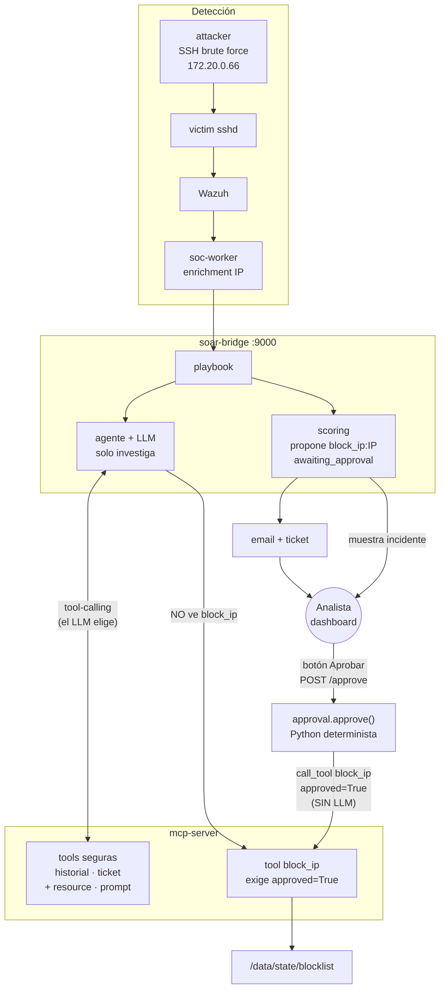

# Diagrama de arquitectura (lab actual)

Flujo: **ataque SSH → Wazuh → soc-worker → soar-bridge → (IA investiga) → HITL → blocklist**.

Punto clave: el **LLM no ejecuta el bloqueo**. El botón del dashboard llama a MCP en código (`approved=True`).



## Dos caminos distintos (para la clase)

| Camino | Quién decide | Qué hace |
|--------|----------------|----------|
| **Investigación** | LLM (tool-calling) | Lee historial, crea ticket, escribe RESOLUCION |
| **Bloqueo** | Analista + código | Botón → `approval.approve()` → `block_ip(approved=True)` |

```text
LLM  ──tools seguras──► MCP
Analista ──botón──► approval.py ──block_ip(approved=True)──► MCP ──► blocklist
```

## Etapas en una frase

1. Ataque SSH real → logs → Wazuh.
2. Worker enriquece IP y manda al bridge.
3. Agente: prompt/resource MCP + tools seguras; **sin** `block_ip` en el catálogo del LLM.
4. Scoring propone acción y deja `awaiting_approval`.
5. Analista aprueba en `:9000` → código llama MCP → blocklist.

## URLs

| Qué | Dónde |
|-----|--------|
| Dashboard | http://localhost:9000 |
| Wazuh | https://localhost:443 |
